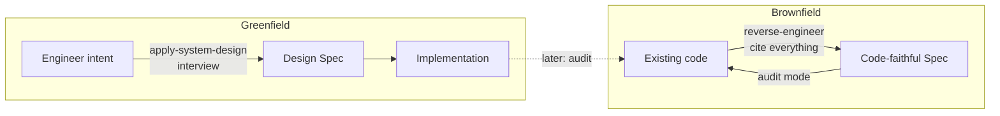

# Standard System Design — with Agents

A rigorous **Systems Design Specification Standard** plus two agent **skills** that put it to work. The goal: specs that are *succinct, complete, and — above all — true*, whether you're designing a new system or documenting an existing one.

## Why this exists

A design spec is only useful if it's trustworthy. The most common failure of both humans and AI agents is writing **plausible fiction** — inventing throughput numbers, assuming `CASCADE` deletes, guessing an endpoint returns HTML when it returns JSON. A confident, well-formatted spec with one fabricated fact is *worse* than no spec, because it gets trusted and propagated.

This repo encodes the discipline that prevents that, and the workflows that apply it.

## What's here

| File | Purpose |
|---|---|
| [`systems-design-specification-standard.md`](systems-design-specification-standard.md) | **The standard.** Phases 0–5 (Orientation → C4 → Domain/Data → Access Patterns → Contract → Failure Modes) + **§0 Evidence & Authoring Discipline** (the anti-fabrication rules) + Self-Check. |
| [`skills/apply-system-design/`](skills/apply-system-design/SKILL.md) | **Design a new system.** Guided interview that walks an engineer through the standard *before coding*. |
| [`skills/reverse-engineer-system-design/`](skills/reverse-engineer-system-design/SKILL.md) | **Document or audit an existing system.** Turns real code into a fully-cited spec, and keeps the spec in sync (zero-divergence audit). |

## The core discipline (§0 of the standard)

Both skills enforce the same rules:

1. **Cite or don't claim** — every schema, route, limit, and behavior traces to `file:line`, a config key, or a migration.
2. **Never fabricate numbers** — label every metric `measured` / `configured` / `inferred-intent`; mark unknowns `UNKNOWN — needs telemetry`.
3. **Read the DDL, don't guess it** — exact types, constraints, all enum values, real deletion behavior.
4. **Verify the shape of every contract** — read the handler before describing what it returns.
5. **Enumerate the full surface** — grep every route; don't stop at the marketed ones.
6. **DTO ≠ schema** — responses are contracts; note omitted internal fields.
7. **State uncertainty** — "I could not find X" beats a confident guess.

> When in doubt, the move is always the same: **open the file and read it** (reverse-engineering) or **ask the engineer** (greenfield).

## Skill discovery (single source of truth)

The skills live **once** in [`skills/`](skills/). Agents look for skills in tool-specific
directories, so those are provided as **symlinks back to `skills/`** — there are no copies to keep in sync, and editing a `SKILL.md` updates it everywhere at once.

```
skills/                          ← source of truth (tool-agnostic; edit here)
├── apply-system-design/SKILL.md
└── reverse-engineer-system-design/SKILL.md
.claude/skills  ->  ../skills    ← Claude Code (and the subagents it spawns) discover skills here
.agents/skills  ->  ../skills    ← non-Claude agents that read .agents/skills discover them here
```

Both symlinks are committed, so a fresh clone works immediately. If you add a tool with a
different convention, just add another symlink to `skills/` rather than copying files. To
recreate the symlinks by hand:

```sh
ln -s ../skills .claude/skills
ln -s ../skills .agents/skills
```

> The in-skill link to [`systems-design-specification-standard.md`](systems-design-specification-standard.md)
> resolves relative to the real file location (`skills/<name>/` → `../../`), so it works through
> either symlink.

## Using the skills

In a Claude Code session, invoke the matching skill (`/apply-system-design` or
`/reverse-engineer-system-design`), or just describe the task and let it auto-trigger:
- Designing something new → **apply-system-design**
- Documenting / auditing existing code → **reverse-engineer-system-design**

Both produce a single Markdown spec (e.g. `docs/SYSTEM-DESIGN-SPEC.md`) with Mermaid C4 + ER diagrams, a glossary, and the standard's Self-Check appendix.

## The two workflows at a glance


