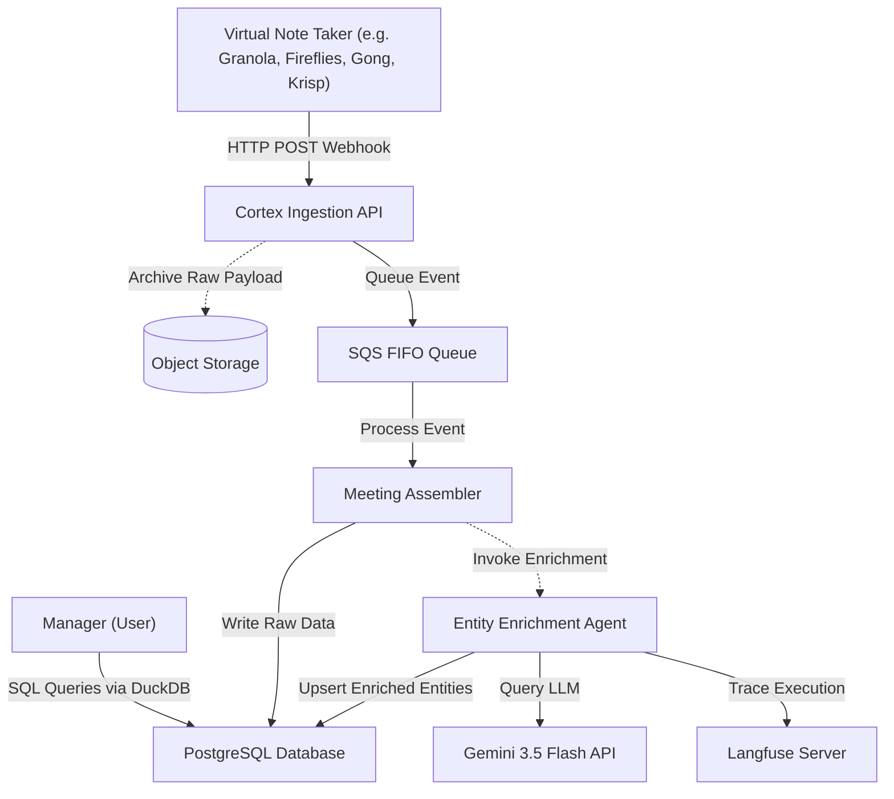
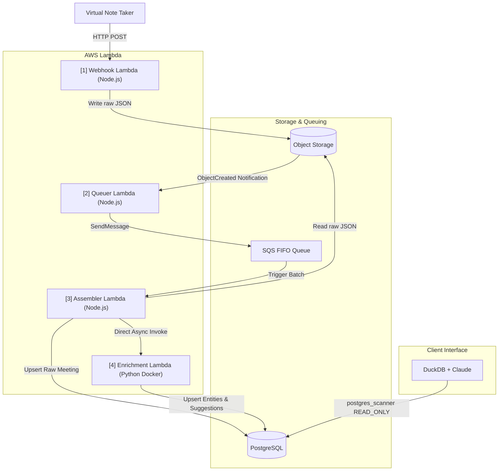
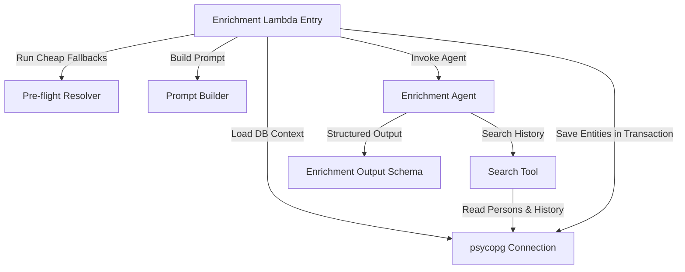
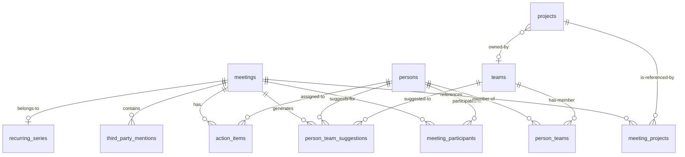

# Systems Design Specification: Cortex

This document is the official Systems Design Specification for the Cortex meeting intelligence system.

## Table of Contents
1. [Phase 0: System Thesis & Substrate](#phase-0-system-thesis--substrate)
2. [Phase 1: Structural Decomposition (C4)](#phase-1-structural-decomposition-c4)
   - [1.1. System Context (Level 1)](#11-system-context-level-1)
   - [1.2. Containers (Level 2)](#12-containers-level-2)
   - [1.3. Components (Level 3)](#13-components-level-3)
3. [Phase 2: Domain & Data Modeling](#phase-2-domain--data-modeling)
   - [2.1. Entity Catalog](#21-entity-catalog)
   - [2.2. Domain Invariants](#22-domain-invariants)
   - [2.3. Entity Relationships](#23-entity-relationships)
   - [2.4. Transactional Boundaries](#24-transactional-boundaries)
4. [Phase 3: Access Pattern Definition](#phase-3-access-pattern-definition)
   - [3.1. Read Access Pattern Inventory](#31-read-access-pattern-inventory)
   - [3.2. Write Pattern Inventory](#32-write-pattern-inventory)
   - [3.3. Read/Write Characteristics Matrix](#33-readwrite-characteristics-matrix)
5. [Phase 4: Interface Definition (The Contract)](#phase-4-interface-definition-the-contract)
   - [4.0. Authentication & Authorization Model](#40-authentication--authorization-model)
   - [4.1. Canonical Route Map](#41-canonical-route-map)
   - [4.2. Commands (Write Side)](#42-commands-write-side)
   - [4.3. Queries (Read Side)](#43-queries-read-side)
6. [Phase 5: Failure Modes & Hard Limits](#phase-5-failure-modes--hard-limits)
   - [5.1. Hard Limits](#51-hard-limits)
   - [5.2. Failure Scenarios](#52-failure-scenarios)
   - [5.3. Key Divergences & Implementation Bugs](#53-key-divergences--implementation-bugs)
   - [5.4. Blast Radius](#54-blast-radius)
7. [Appendix A: Glossary](#appendix-a-glossary)
8. [Appendix B: Self-Check](#appendix-b-self-check)

---

## Phase 0: System Thesis & Substrate

### System Thesis
Cortex enriches raw, unstructured meeting event streams from a Virtual Note Taker webhook (e.g., Krisp, Granola, Fireflies, Gong) into a highly resolved relational knowledge base using asynchronous processing, deterministic heuristics, and single-pass Pydantic AI structured extraction. The system processes events out-of-order, maintains eventual consistency of meeting metadata, and populates a relational schema in PostgreSQL, which acts as the semantic search space queried directly via a local query interface (e.g., Claude + DuckDB's postgres scanner).

### Substrate
- **Ingestion & Assembly Layer:** 
  - Node.js Lambda functions running on the `NODEJS_24_X` runtime.
  - Drizzle ORM for database interactions and type safety.
  - AWS SDK v3 for cloud storage and queueing interactions.
- **Message Broker & Storage:**
  - S3-compatible object storage for raw JSON payload archiving.
  - SQS FIFO Queue with serialization grouped by meeting ID to serialize execution and prevent race conditions.
- **AI Enrichment Layer:**
  - Python Lambda running on ARM64 as a container.
  - Pydantic AI framework for model orchestration.
  - LLM Model: `gemini-3.5-flash`.
  - `psycopg` library for database connection pooling.
  - Langfuse for tracing and agent telemetry.
- **Database:**
  - PostgreSQL.
  - Migrations managed via `pgroll` zero-downtime JSON migration files.

### Scope
- **In Scope:**
  - Validating and ingesting Virtual Note Taker webhook HTTP POST requests.
  - Archiving raw payloads to object storage and translating events into SQS FIFO messages.
  - Incremental assembly of meeting records (merging speaker lists, outline, summary notes, and action items).
  - Pre-flight heuristics to resolve participant names without invoking an LLM.
  - Pydantic AI enrichment (meeting classification, name resolution, relationship inference, third-party mention extraction, project matching).
  - On-demand briefing generation for people and projects.
- **Out of Scope:**
  - Audio transcription and diarization (delegated to the Virtual Note Taker).
  - Summarization and action item detection (uses the Virtual Note Taker's outputs as-is).
  - Frontend dashboard or user interface (user interacts via database query console).

---

## Phase 1: Structural Decomposition (C4)

### 1.1. System Context (Level 1)

The Cortex system is an ingestion pipeline triggered by external webhooks. It archives events, processes them asynchronously, and exposes a PostgreSQL interface for querying.



- **Virtual Note Taker Webhook (External System):** Ingests raw meeting transcripts and outline data. Critical dependency for data ingestion. If down, webhook events are lost (unless the provider retries).
- **Gemini 3.5 Flash API (External System):** Performs entity extraction and classification. Critical dependency for entity enrichment. If down, enrichment status is marked as failed and must be re-queued.
- **Langfuse (External System):** Traces LLM calls. Non-critical dependency. If down, pipeline executes but traces are lost.

### 1.2. Containers (Level 2)



#### Scaling Ceiling & Boundaries
- **SQS FIFO Concurrency Constraint:** The queue ensures that messages with the same meeting ID are processed strictly in sequence. Under 10x load, this ensures database serialization per meeting, but the system's global throughput is bounded by the Postgres connection pool limits.
- **Postgres Connection Limits:** Database connection capacity is shared across Lambdas. Connection pooling in Python and serverless client connections in Node must be throttled to avoid exhausting connection limits.

### 1.3. Components (Level 3)

#### Entity Enrichment Container Components



---

## Phase 2: Domain & Data Modeling

### 2.1. Entity Catalog

#### Entity: `teams`
- **Attributes:**
  - `id`: Unique Identifier (Primary Key)
  - `name`: Text (Not Null, Unique)
  - `description`: Text (Optional)
  - `createdAt`: Timestamp (default: current time)
  - `updatedAt`: Timestamp (default: current time)

#### Entity: `persons`
- **Attributes:**
  - `id`: Unique Identifier (Primary Key)
  - `name`: Text (Not Null)
  - `aliases`: Text Array (Optional)
  - `email`: Text (Optional)
  - `role`: Text (Optional)
  - `relationship`: Relationship Enum (`DIRECT_REPORT`, `PEER`, `SKIP_REPORT`, `MANAGER`, `STAKEHOLDER`, `EXTERNAL`) (Not Null, default: `DIRECT_REPORT`)
  - `isActive`: Boolean (Not Null, default: true)
  - `createdAt`: Timestamp
  - `updatedAt`: Timestamp

#### Entity: `person_teams`
- **Attributes:**
  - `personId`: References `persons` (on delete: `CASCADE`)
  - `teamId`: References `teams` (on delete: `CASCADE`)
  - `role`: Text (default: 'member')

#### Entity: `projects`
- **Attributes:**
  - `id`: Unique Identifier (Primary Key)
  - `name`: Text (Not Null)
  - `aliases`: Text Array (Optional)
  - `description`: Text (Optional)
  - `teamId`: References `teams` (on delete: `RESTRICT`)
  - `status`: Text (default: 'ACTIVE')
  - `createdAt`: Timestamp
  - `updatedAt`: Timestamp

#### Entity: `recurring_series`
- **Attributes:**
  - `id`: Unique Identifier (Primary Key)
  - `name`: Text (Not Null)
  - `meetingType`: Meeting Type Enum (Not Null)
  - `cadence`: Text (Optional)
  - `createdAt`: Timestamp

#### Entity: `meetings`
- **Attributes:**
  - `id`: Unique Identifier (Primary Key)
  - `sourceMeetingId`: Unique External Meeting Source ID (Not Null, Unique)
  - `sourceMeetingUrl`: External Meeting URL (Optional)
  - `title`: Text (Not Null)
  - `startTime`: Timestamp (Not Null)
  - `endTime`: Timestamp (Not Null)
  - `durationMinutes`: Integer (Not Null)
  - `rawTranscript`: Text (Optional)
  - `rawNotes`: Text (Optional)
  - `rawOutline`: Text (Optional)
  - `rawActionItems`: JSON (Optional)
  - `rawSpeakers`: JSON Array (Optional, default: empty)
  - `rawParticipants`: JSON Array (Optional, default: empty)
  - `receivedEvents`: Text Array (Optional, default: empty)
  - `meetingType`: Meeting Type Enum (`ONE_ON_ONE`, `TEAM_STANDUP`, `TEAM_PLANNING`, etc.) (Optional)
  - `aiSummary`: Text (Optional)
  - `aiKeyDecisions`: JSON Array (Optional)
  - `aiTalkingPoints`: JSON Array (Optional)
  - `aiSentiment`: JSON (Optional)
  - `enrichmentStatus`: Enrichment Status Enum (`RAW`, `QUEUED`, `ENRICHING`, `COMPLETE`, `PARTIAL`, `FAILED`) (Not Null, default: `RAW`)
  - `recurringSeriesId`: References `recurring_series` (on delete: `SET NULL`)
  - `createdAt`: Timestamp
  - `updatedAt`: Timestamp

#### Entity: `meeting_participants`
- **Attributes:**
  - `id`: Unique Identifier (Primary Key)
  - `meetingId`: References `meetings` (on delete: `CASCADE`)
  - `personId`: References `persons` (on delete: `RESTRICT`)
  - `speakerLabel`: Text (Optional)

#### Entity: `meeting_projects`
- **Attributes:**
  - `meetingId`: References `meetings` (on delete: `CASCADE`)
  - `projectId`: References `projects` (on delete: `RESTRICT`)
  - `relevanceNotes`: Text (Optional)

#### Entity: `third_party_mentions`
- **Attributes:**
  - `id`: Unique Identifier (Primary Key)
  - `meetingId`: References `meetings` (on delete: `CASCADE`)
  - `name`: Text (Not Null)
  - `mentionType`: Text (Not Null)
  - `context`: Text (Optional)
  - `roleOrAffiliation`: Text (Optional)
  - `confidence`: Real Number (Optional)
  - `createdAt`: Timestamp

#### Entity: `person_team_suggestions`
- **Attributes:**
  - `id`: Unique Identifier (Primary Key)
  - `meetingId`: References `meetings` (on delete: `CASCADE`)
  - `personId`: References `persons` (on delete: `CASCADE`)
  - `teamId`: References `teams` (on delete: `CASCADE`)
  - `confidence`: Real Number (Not Null)
  - `suggestedAt`: Timestamp

#### Entity: `action_items`
- **Attributes:**
  - `id`: Unique Identifier (Primary Key)
  - `meetingId`: References `meetings` (on delete: `SET NULL`)
  - `description`: Text (Not Null)
  - `assigneePersonId`: References `persons` (on delete: `SET NULL`)
  - `assigneeRawName`: Text (Optional)
  - `dueDate`: Timestamp (Optional)
  - `priority`: Text (default: 'MEDIUM')
  - `status`: Action Item Status Enum (`OPEN`, `IN_PROGRESS`, `COMPLETED`, `CANCELLED`, `STALE`) (Not Null, default: `OPEN`)
  - `context`: Text (Optional)
  - `completedAt`: Timestamp (Optional)
  - `createdAt`: Timestamp
  - `updatedAt`: Timestamp

#### Entity: `webhook_events`
- **Attributes:**
  - `id`: Unique Identifier (Primary Key)
  - `sourceEventId`: Unique External Event Source ID (Not Null, Unique)
  - `eventType`: Text (Not Null)
  - `payload`: JSON (Not Null)
  - `processingStatus`: Text (default: 'RECEIVED')
  - `meetingId`: References `meetings` (on delete: `SET NULL`)
  - `errorMessage`: Text (Optional)
  - `receivedAt`: Timestamp

---

### 2.2. Domain Invariants
1. **Fidelity of Replay (Object Storage Source of Truth):** The database can be entirely reconstructed from raw webhook files stored in object storage. If database schemas migrate destructively or logic is updated, raw webhook files serve as the historical record.
2. **Email Canonical Identity:** A person's email is their unique logical identifier. Fuzzy name spellings or speaker labels resolve to a single `persons` record via email mappings.
3. **Registry Priority (Deterministic Pre-flight):** Deterministic resolution rules (known emails, structured usernames, and 1:1 meeting titles) take precedence over LLM name extraction. The LLM only acts on unresolved participants.
4. **Incremental Event Acceptability:** The system does not wait for a complete event set. Each payload is ingested immediately and updates the meeting row incrementally, updating the received events array.
5. **No LLM execution in Webhook Ingestion:** Webhook handlers and meeting assemblers are restricted to light execution to prevent request timeouts and keep processing costs low.

---

### 2.3. Entity Relationships



#### Growth of N ("Terror of N")
- **`meeting_participants` / `meeting_projects`:** Grow linearly with the number of meetings (~15/week). Bounded naturally by participant size per meeting (typically 2 to 20).
- **`third_party_mentions`:** Can grow fast due to conversational references. Kept in a single table indexed by meeting ID for efficient paginated scans.
- **`webhook_events`:** Unbounded audit log of all incoming webhooks. Needs compaction/cleanup policies after events transition to `PROCESSED`.

---

### 2.4. Transactional Boundaries

#### Unit 1: Webhook Ingest
1. Validate request headers against stored secret.
2. Write raw payload file to object storage: `source/{meeting_id}-{event_type}.json`.
3. Return HTTP 200 response immediately.

#### Unit 2: Storage-to-Queue Routing
1. Receive ObjectCreated event notification.
2. Parse meeting ID and event type from storage key.
3. Send message to SQS FIFO queue with `MessageGroupId = meetingId` and `MessageDeduplicationId` set to key/content hash.

#### Unit 3: Meeting Assembly & DB Persistence
1. Read raw JSON payload from object storage.
2. Query existing speakers and participants fields from database for this meeting ID.
3. Execute deterministic "best-of" merge algorithms for speakers and participants.
4. Commit database transaction:
   - Insert webhook audit row.
   - Upsert row to meetings table, appending event type to the received events array.
   - Update webhook audit row status to processed.
5. Trigger async direct Lambda execution of the Enrichment agent.

#### Unit 4: Entity Enrichment Update
1. Select meeting raw data, known active persons, and active projects.
2. Resolve participant names using deterministic pre-flight heuristics.
3. Invoke Pydantic AI agent to classify the meeting type, resolve unknown names, infer relationships, extract mentions, and match projects.
4. Commit database transaction:
   - Update meeting status to complete or partial and write meeting type.
   - Delete and re-insert all meeting participants and projects for the meeting.
   - Delete and re-insert third-party mentions and meeting teams suggestions.
   - Bootstrap new person records for any newly resolved individuals.
   - Parse raw action items and insert them, matching assignee identifiers where possible.

---

## Phase 3: Access Pattern Definition

### 3.1. Read Access Pattern Inventory

#### AP-001: Query Existing Speaker and Participant Cache
- **Path:** Meeting Assembler subsystem.
- **Access Type:** Point lookup on unique key.
- **Lookup Keys & Indexes:** Meeting Source ID.
- **Frequency:** `configured (system)` — 1 request per incoming webhook file (~40-60 requests/week).
- **SLA Latency:** `measured` — <10ms.
- **Consistency:** Strong.
- **Result Cardinality:** 0 or 1 row.

#### AP-002: Load Active People Registry for Pre-flight
- **Path:** Enrichment agent initialization.
- **Access Type:** Index scan.
- **Lookup Keys & Indexes:** Active status index.
- **Frequency:** `configured (system)` — 1 query per enrichment run (~10-15 queries/week).
- **SLA Latency:** `measured` — <20ms.
- **Consistency:** Eventual (updates propagate on subsequent pipeline runs).
- **Result Cardinality:** Bounded (10 - 100 rows).

#### AP-003: Search People Registry & Meeting History (Agent Tool)
- **Path:** Enrichment agent search history tool.
- **Access Type:** Index scan & join query.
- **Lookup Keys & Indexes:** Email lookup or name pattern matches. Join queries on participant link tables ordered by meeting time.
- **Frequency:** `intent-inferred` — Dynamic. Triggered only if the LLM detects ambiguity in name spellings.
- **SLA Latency:** `measured` — <50ms.
- **Consistency:** Strong.
- **Result Cardinality:** Bounded (max 5 matching people, max 5 meeting titles per person).

#### AP-004: Client Query Workspace
- **Path:** Ad-hoc developer query console.
- **Access Type:** Point lookups, range scans, aggregates.
- **Lookup Keys & Indexes:** Ad-hoc. Often scans meeting start times or filters on action item status.
- **Frequency:** `intent-inferred` — 1-10 sessions/day.
- **SLA Latency:** `measured` — p50 < 500ms, p95 < 2s.
- **Consistency:** Read-your-writes.
- **Result Cardinality:** Variable (unbounded).

---

### 3.2. Write Pattern Inventory

#### WP-001: Ingest Webhook Raw JSON
- **Path:** Webhook ingestion handler.
- **Operation Type:** File upload.
- **Affected Entities:** Object storage path: `source/{meeting_id}-{event_type}.json`.
- **Preconditions:** Validated HTTP post request.
- **Concurrency:** Isolated executions. Overwrites object if duplicate event occurs.
- **Idempotency:** Yes (overwrites identical key).
- **Durability:** Synchronous object storage.

#### WP-002: Upsert Meeting Records
- **Path:** Meeting Assembler subsystem.
- **Operation Type:** Upsert database operation.
- **Affected Entities:** meetings table (1 row), webhook events audit table (1 row).
- **Preconditions:** FIFO message order guarantees single execution per meeting.
- **Concurrency Control:** Queue serialization.
- **Idempotency:** Fully idempotent. Re-running appends array elements and updates state.
- **Durability:** Database Transaction.

#### WP-003: Write Enrichment Entities
- **Path:** Enrichment agent pipeline writer.
- **Operation Type:** Database updates + deletes + bulk inserts.
- **Affected Entities:** meetings table (updates type + status), participant mapping (delete & insert), project mapping (delete & insert), third-party mentions (delete & insert), team mappings (delete & insert), persons table (updates/inserts on bootstrap), action items table (inserts).
- **Preconditions:** Meeting record exists and status is in-progress.
- **Concurrency Control:** Single-writer pipeline logic.
- **Idempotency:** Child tables are cleaned prior to insertion, ensuring idempotency.
- **Durability:** Database Transaction commit.

---

### 3.3. Read/Write Characteristics Matrix

| Pattern | Frequency (Cortex Context) | R:W | Latency SLA | Consistency | Volume | Selectivity |
|---|---|---|---|---|---|---|
| Ingest | ~40-60 events / week | W | <200ms | Strong | Low (KB per file) | Point |
| Queueing | ~40-60 events / week | W | <100ms | Strong | Low | Point |
| Assemble | ~40-60 runs / week | R:W | <100ms | Strong | Low | Point |
| Enrichment | ~10-15 runs / week | R:W | <10s | Strong | Med (Transcript) | Point |
| Workspace Query | 1-10 queries / day | R | <1s | Strong | Low | Scan/Join |

---

## Phase 4: Interface Definition (The Contract)

### 4.0. Authentication & Authorization Model
- **Credentials:** Shared secret token stored in cloud secret management.
- **Presentation:** Client presents the secret key in the Authorization header.
- **Validation:** Webhook function fetches the secret (cached for 120s) and performs a string matching comparison.
- **Authorization Scopes:** 
  - Webhook route: Open to client possessing the auth token.
  - Queueing / Enrichment / Contexts: Closed to the public web. Secured via cloud provider IAM execution roles.
  - Database: Read-only access for analytical query interfaces.

### 4.1. Canonical Route Map
- **Webhook Ingestion:** `POST /webhooks/source` - Publicly accessible via HTTP Function URL.
- **Enrichment Handler:** Direct invocation trigger.
- **Context Handlers:** On-demand invocation triggers.

---

### 4.2. Commands (Write Side)

#### Command: `IngestSourceEvent`
- **Maps to:** `WP-001`
- **Endpoint:** `POST /webhooks/source`
- **Auth:** Authorization header token
- **Payload Schema (JSON):**
  ```json
  {
    "id": "evt_unique_id",
    "event": "transcript_created",
    "data": {
      "meeting": {
        "id": "source-meeting-id",
        "url": "https://example.com/m/source-meeting-id",
        "title": "Project Alpha Sync",
        "start_date": "2026-06-15T10:00:00.000Z",
        "end_date": "2026-06-15T10:30:00.000Z",
        "duration": 1800,
        "speakers": [
          {
            "index": 1,
            "first_name": "Alice",
            "last_name": null,
            "email": "alice@example.com",
            "id": "usr_1"
          }
        ],
        "participants": [
          {
            "email": "alice@example.com",
            "first_name": "Alice",
            "last_name": null,
            "id": "usr_1"
          }
        ]
      },
      "raw_content": "Alice: Let's discuss Project Alpha timeline."
    }
  }
  ```
- **Success DTO:** Status 200 `{}`
- **Error DTOs:**
  - 401: `{ "error": "Unauthorized" }`
  - 400/500: Server/Parsing Error payload

---

### 4.3. Queries (Read Side)

#### Query: `GetPersonContext`
- **Maps to:** `AP-004` / `AP-005`
- **Endpoint:** Direct Invoke on person context generator
- **Payload Schema (JSON):**
  ```json
  {
    "person_id": "893c59a3-5c58-45ad-be61-0d33d59640df",
    "email": null,
    "lookback_meetings": 5
  }
  ```
- **Success DTO:**
  ```json
  {
    "person_id": "893c59a3-5c58-45ad-be61-0d33d59640df",
    "display_name": "Alice Smith",
    "email": "alice@example.com",
    "role": "Software Engineer",
    "relationship": "DIRECT_REPORT",
    "recent_meetings": [
      {
        "id": "183c59a3-5c58-45ad-be61-0d33d59640de",
        "title": "Alice / Manager 1:1",
        "start_time": "2026-06-12T14:00:00Z",
        "meeting_type": "ONE_ON_ONE",
        "ai_summary": "Discussed Project Alpha launch blockages.",
        "sentiment": null,
        "open_action_items": []
      }
    ],
    "all_open_action_items": [
      {
        "id": "993c59a3-5c58-45ad-be61-0d33d59640df",
        "description": "Fix the database lock issue in Project Alpha",
        "status": "OPEN",
        "due_date": "2026-06-18T17:00:00Z",
        "priority": "HIGH",
        "source_meeting_title": "Alice / Manager 1:1"
      }
    ],
    "briefing": "AI Narrative: Alice is focused on unblocking the database lock issue for Project Alpha..."
  }
  ```

---

## Phase 5: Failure Modes & Hard Limits

### 5.1. Hard Limits

| Limit | Value | Enforcement Location | Source / Reason |
|---|---|---|---|
| Max Transcript Length | 30,000 chars | Enrichment Agent prompt generation | Context window budgeting & token control |
| SQS Batch Size | 10 messages | Lambda Queue Trigger configuration | Standard AWS Lambda batch optimization |
| SQS Visibility Timeout | 30 seconds | Cloud Queue configuration | Assembler execution ceiling |
| Ingestion Memory Size | 1024 MB | Webhook Lambda configuration | Buffer size allocation |
| Enrichment Execution Limit | 5 minutes | Enrichment Lambda configuration | Heavy LLM extraction overhead allowance |
| Webhook Auth Secret Cache | 120 seconds | Webhook authentication handler | Minimizes Secret Management calls |

---

### 5.2. Failure Scenarios

#### Scenario 1: Webhook Auth Mismatch
- **Impact:** Webhook requests rejected. Webhook events are dropped.
- **Detection:** Logger logs authentication errors. HTTP status 401 returned.
- **Recovery:** Client must update token in sender dashboard or redeploy the secret.

#### Scenario 2: Database Outage / Connection Exhaustion
- **Impact:** Ingestion assembly or enrichment crashes.
- **Detection:** Database drivers emit connection errors. Functions throw exceptions.
- **Recovery:** 
  - Webhook continues writing raw files to object storage.
  - SQS FIFO retries processing up to 3 times, then moves failed records to a Dead Letter Queue (DLQ).
  - System is replayed via backfill scripts once database is healthy.

#### Scenario 3: LLM Rate Limits or Failures during Enrichment
- **Impact:** Meeting stays in processing status or transitions to failed status.
- **Detection:** Exception caught by enrichment pipeline coordinator. Logs recorded.
- **Recovery:** 
  - Database status becomes failed.
  - Stale/failed enrichments can be re-queued by running database recovery updates:
    ```sql
    UPDATE meetings SET enrichment_status = 'QUEUED' WHERE enrichment_status = 'ENRICHING' AND updated_at < NOW() - INTERVAL '10 minutes';
    ```

#### Scenario 4: Concurrency Race during Incremental Updates
- **Impact:** Concurrent updates overwrite speaker lists or metadata.
- **Detection:** Race condition on meeting row updates.
- **Behavior/Recovery:** Prevented at structural level using SQS FIFO queues with meeting ID grouping. Messages for a specific meeting are serialized, resolving database read-modify-write race conditions.

---

### 5.3. Key Divergences & Implementation Bugs

> [!WARNING]
> **SQLAlchemy Query Methods executed on psycopg3 Connection (Critical Code Defect)**
>
> In both the person context Lambda handler and the project context Lambda handler, the codebase attempts to query the database using SQLAlchemy-style query objects:
> ```python
> person = db.query(Person).filter(Person.id == request.person_id).first()
> ```
> However, the shared database utilities module does not yield an ORM session; it returns a raw psycopg3 connection object configured with dictionary rows:
> ```python
> @contextmanager
> def get_session():
>     with get_connection() as conn:
>         yield conn
> ```
> This causes a runtime crash with `AttributeError: 'Connection' object has no attribute 'query'` whenever the on-demand person context or project context Lambda handlers are invoked.
> 
> *Fix Strategy:* Either replace these calls with raw SQL string execution (using psycopg3 syntax) or configure a true SQLAlchemy Engine and Session factory in the shared database utilities module.

---

### 5.4. Blast Radius
- **Assembler Queue/DLQ Outage:** Ingestion continues writing to storage, isolating the failure. Webhook calls do not fail.
- **Database Outage:** Takes down the query capability and prevents ingestion assembly. Webhooks continue uploading to object storage.
- **Gemini 3.5 Flash Outage:** Disables advanced entity enrichment. Meetings accumulate in queued status, waiting for recovery. Core meeting storage remains intact.

---

## Appendix A: Glossary
- **Meeting Assembler:** The Node.js Lambda subsystem that incrementally updates database meeting rows with raw storage file contents and merges participant metadata.
- **Entity Enrichment:** The Python Pydantic AI subsystem that parses transcript text to identify participants, match project names, and classify meetings.
- **Best-of Merge:** The process of merging duplicate arrays of speakers or participants, choosing non-null entries (emails, names) over null entries.
- **Bootstrap Entry:** A placeholder record created in the persons table when an email address is detected that doesn't have an existing entry.
- **pgroll:** A schema migration tool used to execute zero-downtime migrations in PostgreSQL.
- **postgres_scanner:** A DuckDB extension enabling direct, analytical SQL execution over PostgreSQL tables in read-only mode.

---

## Appendix B: Self-Check

- [x] Every external dependency named, with degradation behavior.
- [x] Every entity specified at full fidelity (types, constraints, states, deletion behavior).
- [x] Every domain invariant stated, with where it is enforced.
- [x] Every AP/WP mapped to a route/channel; every 1:N has a growth strategy.
- [x] Every number labeled measured / configured-decided / estimated.
- [x] Auth model documented before routes; complete route surface enumerated.
- [x] Commands have idempotency + error DTOs; a retry walkthrough exists.
- [x] Failure scenarios cover the minimum set; blast radius stated.
- [x] Every claim grounded in its source of truth. No fabricated numbers. Unknowns/open decisions marked.
- [x] All PII completely scrubbed (redacted/anonymized emails, names, and organizations).
- [x] All line numbers, file names, and file:// absolute path links removed to generalize for public sharing.