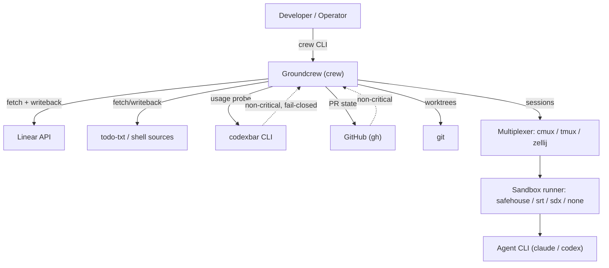
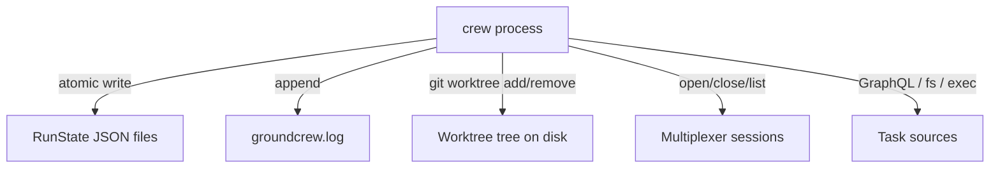
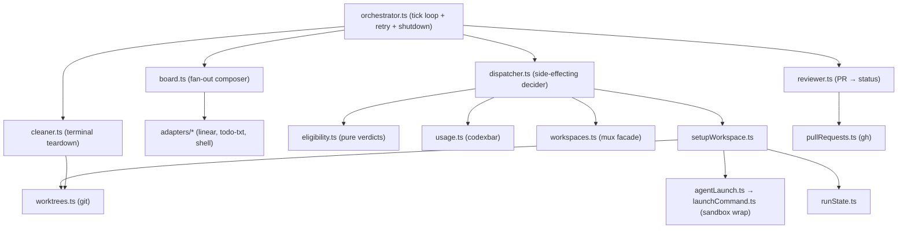
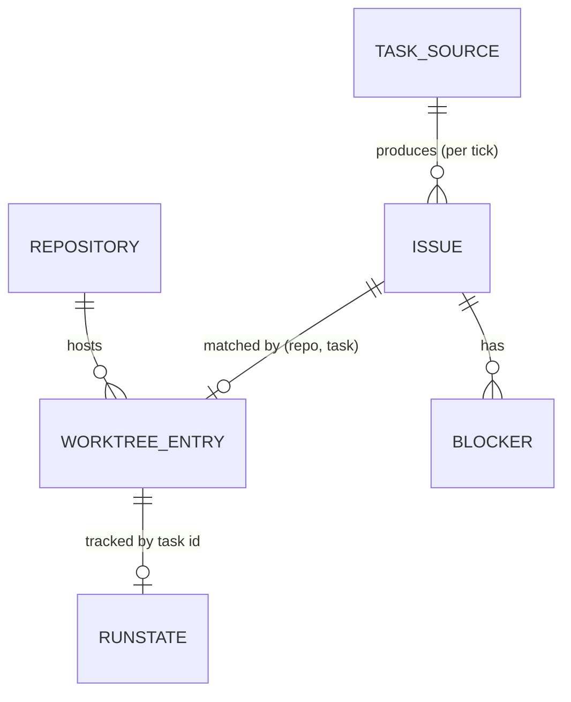

# Systems Design Specification: Groundcrew

**Owner:** Eduardo Romero
**Audience:** All Engineering Levels & AI Agents
**Status:** Code-Faithful & Fully Cited (reverse-engineered)
**Grounded In Version:** `4.40.0` ([package.json](../package.json) `version`)
**Author note:** This is an independent, from-scratch reverse-engineering pass following the Systems Design
Specification Standard. It supersedes claims in [`docs/SYSTEM-DESIGN-SPEC.md`](./SYSTEM-DESIGN-SPEC.md) where they
diverge; corrections to that v1 are called out in [Appendix C](#appendix-c-corrections-to-the-v1-spec).

> Every claim below is traced to a `file:line` source. Numbers are labeled **configured (cite)**, **measured**, or *
*inferred**. Where the code ships no telemetry, the spec says so rather than inventing a number.

---

## Phase 0: System Thesis & Substrate

### System Thesis

Groundcrew is a **single-process, stateless-per-tick orchestrator** that turns a task backlog into parallel local
AI-coding-agent sessions: each tick it fetches a normalized board from pluggable task sources, decides which Todo tasks
may start (slot capacity + usage pacing + blocker/recovery rules), and for each it provisions a dedicated **git worktree
**, wraps the agent command in a **local sandbox**, and launches it inside a **terminal-multiplexer** session. Almost
all of the complexity is the reconciliation between four independent state stores that have no shared transaction — the
**task source** (Todo/In-Progress/In-Review/Done), the **git worktrees on disk**, the **live multiplexer sessions**, and
a thin local **RunState** JSON file — kept convergent by re-deriving truth from the filesystem and the source on every
poll rather than by holding authoritative in-memory state.

### Substrate

- **Runtime:** Node.js `>= 24` ([README.md:35](../README.md), `.nvmrc`), ESM + native TypeScript stripping (
  `bin/run.js`; cosmiconfig `.ts` loader at [config.ts:1212](../src/lib/config.ts)).
  Entry: [src/main.ts](../src/main.ts) → [src/cli.ts](../src/cli.ts).
- **Distribution:** npm CLI `@clipboard-health/groundcrew`, binary `crew` ([package.json](../package.json) `bin`).
- **Config loader:** `cosmiconfig` ([config.ts:1233](../src/lib/config.ts)) discovering `crew.config.{ts,mjs,js,json}`
  etc. ([config.ts:1185-1197](../src/lib/config.ts)).
- **Persistent state:** Local-filesystem JSON only. No database. RunState files + an append-mode log file under the XDG
  state
  dir ([runState.ts:77-83](../src/lib/runState.ts), [config.ts:464-466](../src/lib/config.ts), [xdg.ts:21-23](../src/lib/xdg.ts)).
- **Task sources (pluggable):** built-in **Linear** (`@linear/sdk`, GraphQL), **todo-txt** (local file), **shell** (
  external command emitting JSON) — [src/lib/adapters/](../src/lib/adapters/).
- **Terminal multiplexers:** `cmux`, `tmux`, `zellij` ([workspaces.ts:93-110](../src/lib/workspaces.ts)).
- **Local sandbox runners:** `safehouse` (macOS), `srt` (Anthropic sandbox-runtime, macOS/Linux), `sdx` (Docker
  Sandboxes `sbx`), `none` ([config.ts:64-79](../src/lib/config.ts), [localRunner.ts](../src/lib/localRunner.ts)).
- **Usage/pacing probe:** `codexbar` CLI ([usage.ts:82-141](../src/lib/usage.ts)).
- **PR detection:** `gh` / git remote lookups ([pullRequests.ts](../src/lib/pullRequests.ts), consumed
  by [reviewer.ts](../src/commands/reviewer.ts)).

### Scope

- **In scope:** board polling + normalization across sources; eligibility/pacing decisions; worktree provisioning +
  branch creation; sandbox+multiplexer launch; PR-driven status advancement (in-progress → in-review → done);
  terminal-state teardown.
- **Out of scope (by design):** sandbox *provisioning*/lifecycle (`sbx` owns
  it — [ADR-0001](./adr/0001-groundcrew-uses-but-does-not-provision-sandboxes.md); the `crew sandbox` and
  `crew setup repos` commands were removed, [cli.ts:24-72](../src/cli.ts)); the agent's interactive execution (the
  wrapped CLI owns its own I/O once launched); repository cloning (manual `git clone`, [cli.ts:46-50](../src/cli.ts)).

### The 8 files a newcomer reads first

1. [src/cli.ts](../src/cli.ts) — command surface / dispatch.
2. [src/commands/orchestrator.ts](../src/commands/orchestrator.ts) — the tick loop.
3. [src/commands/dispatcher.ts](../src/commands/dispatcher.ts) + [src/commands/eligibility.ts](../src/commands/eligibility.ts) —
   the start decision.
4. [src/commands/setupWorkspace.ts](../src/commands/setupWorkspace.ts) — provisioning transaction.
5. [src/lib/worktrees.ts](../src/lib/worktrees.ts) — git worktree lifecycle.
6. [src/lib/config.ts](../src/lib/config.ts) — every default and limit.
7. [src/lib/taskSource.ts](../src/lib/taskSource.ts) + [src/lib/board.ts](../src/lib/board.ts) — the source abstraction.
8. [src/lib/runState.ts](../src/lib/runState.ts) — the local state file.

---

## Phase 1: Structural Decomposition (C4)

### 1.1. System Context (Level 1)

#### Users & Roles

- **Developer / Operator:** runs `crew` commands, curates the backlog, reviews PRs, attaches to live sessions,
  resumes/cleans up. The only human role.
- **AI Agent CLI:** the `claude` / `codex` (or custom) process launched inside the sandbox+multiplexer. It can
  self-report completion via injected `GROUNDCREW_COMPLETE` / `GROUNDCREW_TASK_ID`
  env ([setupWorkspace.ts:157-160](../src/commands/setupWorkspace.ts), [config.ts:448](../src/lib/config.ts), env
  strings confirmed in source grep).

#### External Systems

| External                           | Used for                                                         | Criticality                       | Down-for-hours behavior                                                                                                                                                                                                                          |
|------------------------------------|------------------------------------------------------------------|-----------------------------------|--------------------------------------------------------------------------------------------------------------------------------------------------------------------------------------------------------------------------------------------------|
| **Linear API**                     | board fetch + status writeback (when Linear source enabled)      | Critical *for Linear source only* | `withRetry` 3 attempts; on rate-limit waits 60s; persistent failure surfaces and the tick proceeds. `board.verify()` failures abort startup. ([orchestrator.ts:24-65](../src/commands/orchestrator.ts), [board.ts:96-110](../src/lib/board.ts))  |
| **Multiplexer (cmux/tmux/zellij)** | host the agent session                                           | Critical (no session = no launch) | `probe` returns `unavailable`; recovery/teardown skip to avoid deleting live work ([workspaces.ts:143-163](../src/lib/workspaces.ts), [eligibility.ts:231-238](../src/commands/eligibility.ts), [worktrees.ts:699-714](../src/lib/worktrees.ts)) |
| **git**                            | fetch, worktree add/remove/prune, branch ops                     | Critical                          | command errors abort the affected task's setup → rollback ([worktrees.ts:266-316](../src/lib/worktrees.ts), [setupWorkspace.ts:196-213](../src/commands/setupWorkspace.ts))                                                                      |
| **codexbar CLI**                   | usage/pacing snapshot                                            | Non-critical (fail-closed)        | per-agent failure → `EXHAUSTED_USAGE` so the agent is *gated*, not run blind ([usage.ts:58-63,194-207](../src/lib/usage.ts)); whole-call failure → proceed with no limits ([orchestrator.ts:79-92](../src/commands/orchestrator.ts))             |
| **GitHub (`gh`)**                  | PR state for reviewer                                            | Non-critical                      | lookup contracted never to reject; failure ≡ "no PR yet" → retry next tick ([reviewer.ts:36-46,153-164](../src/commands/reviewer.ts))                                                                                                            |
| **Safehouse / clearance**          | macOS egress allowlist + sandbox                                 | Critical when `runner=safehouse`  | `ensureClearance` must succeed before launch ([agentLaunch.ts:152-157,207-223](../src/lib/agentLaunch.ts))                                                                                                                                       |
| **sbx (Docker Sandboxes)**         | sandbox when `runner=sdx`                                        | Critical when `runner=sdx`        | missing `sbx` on PATH throws pre-launch ([localRunner.ts:74-84](../src/lib/localRunner.ts))                                                                                                                                                      |
| **Invisible deps**                 | OS user (branch prefix), clock (timestamps), local FS, `$EDITOR` | mixed                             | branch prefix throws if no username ([worktrees.ts:62-73](../src/lib/worktrees.ts))                                                                                                                                                              |



### 1.2. Containers (Level 2)

Groundcrew is a **single Node process** per invocation; "containers" here are logical runtime boundaries, not separate
deployables.

- **`crew` CLI process** — parses argv, dispatches one subcommand ([cli.ts:278-318](../src/cli.ts)). In
  `crew run --watch` it becomes a long-lived loop ([orchestrator.ts:172-242](../src/commands/orchestrator.ts)); every
  other command is one-shot.
- **RunState store** — directory of per-task JSON files; atomic write-then-rename,
  `0o600` ([runState.ts:160-166](../src/lib/runState.ts)).
- **Log file** — append-mode tee of `log()`/`logEvent()` output ([config.ts:279-287](../src/lib/config.ts)).
- **Worktree tree** — `<worktreeDir>/<repo>-<task>/` directories on
  disk ([worktrees.ts:179-202](../src/lib/worktrees.ts)).
- **Multiplexer sessions** — external, host-owned; addressed by task id.



#### Staff Challenge / Scaling ceiling

- **Single writer, single host.** There is no lock or lease between two `crew` processes; safety against double-dispatch
  rests on (a) one watch loop per host being the intended deployment and (b) `worktrees.create` throwing
  `WorktreeAlreadyExistsError` if the dir already exists ([worktrees.ts:628-647](../src/lib/worktrees.ts)). Two
  concurrent `crew run` loops on the same repo **can** race between the `findByTask` check and `git worktree add`;
  nothing serializes them across processes.
- **First thing that breaks under 10×:** the Linear fetch is one page of `250`
  issues ([fetch.ts:23,213](../src/lib/adapters/linear/fetch.ts)) and the per-tick work is serial per
  task ([dispatcher.ts:315-318](../src/commands/dispatcher.ts)); host CPU/disk for N parallel agents and source-API rate
  limits are the ceiling, not groundcrew's own throughput.

### 1.3. Components (Level 3)



- **Pure vs side-effecting split:** `eligibility.ts` is pure (verdicts only); `dispatcher.ts` does the logging,
  writeback, and `setupWorkspace`
  calls ([eligibility.ts:1-8](../src/commands/eligibility.ts), [dispatcher.ts:1-8](../src/commands/dispatcher.ts)). This
  is the system's main testability seam.
- **Adapter interface:** every source implements `TaskSource` ([taskSource.ts:160-212](../src/lib/taskSource.ts));
  `Board` is the only thing consumers touch ([board.ts:19-42](../src/lib/board.ts)).
- **Testing pain points:** anything shelling out — git ([worktrees.ts](../src/lib/worktrees.ts)),
  multiplexers ([cmuxAdapter.ts](../src/lib/cmuxAdapter.ts)/[tmuxAdapter.ts](../src/lib/tmuxAdapter.ts)/[zellijAdapter.ts](../src/lib/zellijAdapter.ts)),
  codexbar ([usage.ts](../src/lib/usage.ts)), gh ([pullRequests.ts](../src/lib/pullRequests.ts)) — is mocked behind a
  facade; the adapters are the failure surfaces.

---

## Phase 2: Domain & Data Modeling

### 2.1. Entity Catalog

#### Entity: RunState (persisted)

- **Store:** one JSON file per task at `runStateDirectory/<normalizedTaskId>.json`, where
  `runStateDirectory = dirname(config.logging.file)/runs` ([runState.ts:77-83](../src/lib/runState.ts)). With default
  logging that resolves to
  `${XDG_STATE_HOME:-~/.local/state}/groundcrew/runs/<task>.json` ([config.ts:464-466](../src/lib/config.ts), [xdg.ts:21-23](../src/lib/xdg.ts)).
  **It is anchored to the log-file directory, not directly to XDG.**
- **Key:** `task` (lower-cased, normalized via
  `normalizePlainTaskId` — [runState.ts:73-75,182-209](../src/lib/runState.ts)).
- **Attributes** ([runState.ts:9-40](../src/lib/runState.ts)) — all strings unless noted; parser rejects the record
  unless every required field is a non-empty string ([runState.ts:107-158](../src/lib/runState.ts)):
    - `task` (req), `repository` (req), `agent` (req; legacy `model` accepted on
      read — [runState.ts:113](../src/lib/runState.ts)), `worktreeDir` (req), `branchName` (req), `workspaceName` (req).
    - `state`: `RunLifecycleState` — **enum, all values:**
      `"running" | "interrupted" | "resumed" | "failed-to-launch"` ([runState.ts:7](../src/lib/runState.ts)).
    - `createdAt`, `updatedAt`: ISO 8601 (req).
    - `resumeCount`: integer `>= 0` (req; non-integer/negative rejects the
      record — [runState.ts:135-137](../src/lib/runState.ts)).
    - `reason?`, `detail?`, `title?`, `url?`, `completionTaskId?` (optional cached/diagnostic
      fields — [runState.ts:20-39](../src/lib/runState.ts)).
- **Lifecycle (write paths):** `recordRunState` only ever writes `running` or
  `failed-to-launch` ([setupWorkspace.ts:176-211](../src/commands/setupWorkspace.ts)); `updateRunState` patches existing
  records to `interrupted`/
  `resumed` ([runState.ts:212-226](../src/lib/runState.ts), [interruptWorkspace.ts](../src/commands/interruptWorkspace.ts), [resumeWorkspace.ts](../src/commands/resumeWorkspace.ts)).

```
[none] --setupWorkspace success--> running
[none] --setupWorkspace failure--> failed-to-launch
running --crew stop--> interrupted
interrupted --crew resume--> resumed
running/interrupted/resumed --teardown (removeRunState)--> [none]
```

> Deletion is a hard `rmSync(..., {force:true})` of the file ([runState.ts:228-230](../src/lib/runState.ts)) — no soft
> delete, no tombstone.

#### Entity: WorktreeEntry (derived from disk, not persisted)

- **Source of truth:** the filesystem. Re-derived every tick by scanning `<worktreeDir>` for `<repo>-<task>` directories
  whose task matches `isPlainTaskId` ([worktrees.ts:318-371](../src/lib/worktrees.ts)).
- **Attributes** ([worktrees.ts:47-55](../src/lib/worktrees.ts)): `repository`, `task` (lowercased natural id),
  `branchName` (`<branchPrefix>-<task>`), `dir` (absolute), `kind` (`"host"` — only value).
- **Branch prefix:** `config.git.branchPrefix` or the OS username; must be a git-ref-safe slash-free
  slug ([worktrees.ts:62-77](../src/lib/worktrees.ts), [config.ts:530-540](../src/lib/config.ts)).

#### Entity: Issue / Task (in-memory, per tick)

- **Canonical normalized form** every adapter produces ([taskSource.ts:57-90](../src/lib/taskSource.ts)):
    - `id`: source-prefixed canonical id, e.g. `linear:eng-220` ([taskSource.ts:262-264](../src/lib/taskSource.ts)).
    - `source`, `title`, `description`, `assignee`, `updatedAt`.
    - `status`: `CanonicalStatus` — **enum, all values:**
      `"todo" | "in-progress" | "in-review" | "done" | "other"` ([taskSource.ts:24](../src/lib/taskSource.ts)).
    - `repository?`, `agent?` (both required for a task to be a
      `GroundcrewIssue` — [taskSource.ts:92-97](../src/lib/taskSource.ts)).
    - `blockers: Blocker[]`, `hasMoreBlockers: boolean`, `url?`, `priority?` (lower sorts first), `sourceRef` (
      adapter-private).
- **Value object `Blocker`** ([taskSource.ts:26-55](../src/lib/taskSource.ts)): `id`, `title`,
  `status: CanonicalStatus`, `statusReason?: "missing" | "unmapped"`, `nativeStatus?`.

#### Value object: ResolvedConfig

Frozen object produced by `applyDefaults`+`validate` ([config.ts:293-348,1016-1181](../src/lib/config.ts)); cached once
per process ([config.ts:1298-1331](../src/lib/config.ts)). Full defaults table in [Phase 5.1](#51-hard-limits).

### 2.2. Domain Invariants

1. **One worktree per (repo, task).** `worktrees.create` throws `WorktreeAlreadyExistsError` if a matching dir
   exists ([worktrees.ts:628-638](../src/lib/worktrees.ts)). *Cross-process races are not locked out* (see 1.2).
2. **Slot ceiling.** New starts are capped at `maximumInProgress − (count of in-progress issues)`; `classifyEligibility`
   stops at `slots`
   starts ([dispatcher.ts:196-221](../src/commands/dispatcher.ts), [eligibility.ts:281-289](../src/commands/eligibility.ts)).
   In-review issues do **not** consume a slot ([reviewer.ts:7-12](../src/commands/reviewer.ts)).
3. **Only `agent-*`+repository tasks are dispatched.** Tasks lacking an agent label or a resolvable known repository are
   filtered out (and a missing-repo task logs a
   WARN) ([dispatcher.ts:201-257](../src/commands/dispatcher.ts), [taskSource.ts:92-97](../src/lib/taskSource.ts)).
4. **Data-loss guard.** A dirty worktree (modified/untracked) is never removed without `--force`; if dirtiness can't be
   confirmed, teardown fails closed ([worktrees.ts:457-467,523-539](../src/lib/worktrees.ts)).
5. **Force-delete is path-fenced.** Orphan-dir removal refuses any path that isn't the exact expected
   `<worktreeDir>/<repo>-<task>` inside the worktree root ([worktrees.ts:594-618](../src/lib/worktrees.ts)).
6. **Blocked tasks wait.** A task with any non-`done` blocker is skipped; if blockers exceeded the relation page (
   `hasMoreBlockers`) it is skipped for manual
   review ([eligibility.ts:101-125,256-268](../src/commands/eligibility.ts)).
7. **Usage gate fails closed.** If codexbar can't be read for an agent, that agent is treated as fully exhausted, never
   run blind ([usage.ts:58-63,194-207](../src/lib/usage.ts)).
8. **Parents are not worked.** A task with sub-issues is dropped from `fetch()` and surfaced as a `parentSkip` log,
   never
   dispatched ([taskSource.ts:99-113](../src/lib/taskSource.ts), [fetch.ts:265-275](../src/lib/adapters/linear/fetch.ts), [dispatcher.ts:183-194](../src/commands/dispatcher.ts)).
9. **`agent-any` resolves to most-headroom agent**, ties broken toward `agents.default`; if none has capacity the task
   is skipped ([eligibility.ts:135-154,293-306](../src/commands/eligibility.ts)).
10. **`any` is a reserved agent name** — config validation rejects an agent literally named
    `any` ([config.ts:36,1121-1125](../src/lib/config.ts)).

### 2.3. Entity Relationships



- **The "Terror of N":**
    - **Issues per fetch:** bounded at `250` for Linear (single
      page) ([fetch.ts:23,213](../src/lib/adapters/linear/fetch.ts)); blockers per issue read from
      `inverseRelations(first: 50)` and labels
      `first: 50` ([fetch.ts:234,414-415](../src/lib/adapters/linear/fetch.ts)) — overflow flagged via
      `hasMoreBlockers`, not silently dropped.
    - **Worktrees on disk:** grow with concurrent runs but are practically bounded by `maximumInProgress`; compacted by
      the cleaner on `done` ([cleaner.ts:38-76](../src/commands/cleaner.ts)) and by manual `crew cleanup`.
    - **RunState files & log:** unbounded over time — RunState files are deleted on
      teardown ([runStateCleanup.ts](../src/lib/runStateCleanup.ts), [cleaner.ts:73](../src/commands/cleaner.ts)), but
      the **append-only log file has no rotation/retention in code** (`UNKNOWN — no compaction strategy found`).
- **Referential integrity:** there are no FKs; all "relationships" are app-derived by matching `(repository, task)`
  strings ([reviewer.ts:96-108](../src/commands/reviewer.ts), [eligibility.ts:224-228](../src/commands/eligibility.ts)).
  A RunState file can outlive its worktree (and vice versa); the system tolerates this by re-deriving from disk each
  tick.

### 2.4. Transactional Boundaries

There is **no multi-store transaction.** Each store commits independently; convergence is by re-derivation. Two "atomic
units" exist only at the single-file / single-git-command level.

#### Unit A — Workspace provisioning (`setupWorkspace`, [setupWorkspace.ts:70-214](../src/commands/setupWorkspace.ts))

1. Resolve runner/sandbox/workspace kind, assert host
   requirements ([agentLaunch.ts:141-201](../src/lib/agentLaunch.ts)).
2. `worktrees.create` → `git fetch` +
   `git worktree add -b <branch> <dir> <remote>/<defaultBranch>` ([worktrees.ts:293-316](../src/lib/worktrees.ts)). (
   Concurrently kicks off sandbox-readiness, e.g. `ensureClearance`.)
3. Stage prompt, build secrets, launch command into a temp prompt
   dir ([setupWorkspace.ts:118-164](../src/commands/setupWorkspace.ts), [stagedLaunch.ts](../src/lib/stagedLaunch.ts)).
4. `workspaces.open` → multiplexer session running the wrapped
   command ([agentLaunch.ts:225-243](../src/lib/agentLaunch.ts)).
5. `recordRunState(state: running)` — best-effort; a write failure is logged, not
   fatal ([setupWorkspace.ts:176-188,274-308](../src/commands/setupWorkspace.ts)).
6. Caller (`dispatcher`/`setupWorkspaceCli`) then `board.markInProgress(issue)` — separate writeback to the
   source ([dispatcher.ts:151](../src/commands/dispatcher.ts), [setupWorkspace.ts:410](../src/commands/setupWorkspace.ts)).

- **Rollback:** any failure after worktree creation triggers `rollbackWorktree` (force teardown of worktree+branch,
  temp-dir cleanup) and records
  `failed-to-launch` ([setupWorkspace.ts:196-213,310-356](../src/commands/setupWorkspace.ts)). If `markInProgress` (step
  6) fails, the workspace is already live but the source still shows Todo — reconciled next tick via the recovery
  path ([eligibility.ts:216-248](../src/commands/eligibility.ts)).

#### Unit B — Teardown (`worktrees.teardown`, [worktrees.ts:699-752](../src/lib/worktrees.ts))

Per entry, sequential: (1) close multiplexer session if live; (2) `git worktree remove` (+ dirty/orphan probing, branch
delete best-effort). A flaky multiplexer does not abort the batch; failures are collected, not
thrown ([worktrees.ts:723-749](../src/lib/worktrees.ts)).

- **Consistency model:** eventual across all four stores; convergence happens on the next poll because the
  dispatcher/reviewer/cleaner re-read disk + source every tick. **Concurrency isolation:** RunState uses
  write-temp-then-`rename` (atomic on POSIX) ([runState.ts:160-166](../src/lib/runState.ts)); git uses its own index
  locks; there is **no optimistic version field** on RunState (last writer wins).

---

## Phase 3: Access Pattern Definition

> Groundcrew ships **no latency/throughput telemetry**. All latency cells below are `UNKNOWN — needs measurement` unless
> the value is a configured timeout. Frequencies are labeled by their config source.

### 3.1. Read Access Patterns (AP)

**AP-101 — Read one RunState**

- Channel: `readFileSync` of `runs/<task>.json` ([runState.ts:168-180](../src/lib/runState.ts)).
- Access: point lookup by task key. Cardinality `0-1`. Consistency: strong (atomic rename). Frequency: per `status`
  /lifecycle command. Latency: `UNKNOWN` (local read).

**AP-102 — List worktrees from disk**

- Channel: `readdirSync` of each known-repo parent under the worktree
  root ([worktrees.ts:318-371](../src/lib/worktrees.ts)).
- Access: directory scan; cardinality `0-N` bounded by on-disk dirs. Frequency: once per
  tick ([orchestrator.ts:136](../src/commands/orchestrator.ts)). Consistency: strong. Latency: `UNKNOWN`.

**AP-103 — Fetch board**

- Channel: per source — Linear GraphQL (`@linear/sdk`), todo-txt file read, or shell subprocess; fanned out by
  `board.fetch()` ([board.ts:112-130](../src/lib/board.ts)).
- Access: filtered list. Linear: viewer-assigned issues carrying `agent-*` labels, single page of
  `250` ([fetch.ts:213](../src/lib/adapters/linear/fetch.ts), [config.ts:160-161](../src/lib/config.ts)). Cardinality
  `0-N` (≤250/Linear page). Frequency: once per tick — **`pollIntervalMilliseconds`, default `120_000` (120s) configured
  ** ([config.ts:387](../src/lib/config.ts)). Consistency: eventual. Latency: `UNKNOWN` (network); wrapped in retry, not
  a measured SLA.

**AP-104 — Probe live workspaces**

- Channel: multiplexer `list` via the selected adapter ([workspaces.ts:143-163](../src/lib/workspaces.ts)).
- Access: set of live session names + exited names. Frequency: lazily, only when a tick has a recovery candidate or
  during teardown ([dispatcher.ts:262-278](../src/commands/dispatcher.ts), [worktrees.ts:713](../src/lib/worktrees.ts)).
  Consistency: point-in-time. Latency: `UNKNOWN` (shell-out).

**AP-105 — Usage snapshot**

- Channel: `codexbar usage --provider <p> --source <s> --format json` per gated
  agent ([usage.ts:82-141](../src/lib/usage.ts)).
- Access: per-agent fractions. Frequency: lazily per tick, only after cheaper filters
  pass ([dispatcher.ts:262,279](../src/commands/dispatcher.ts), [orchestrator.ts:144-150](../src/commands/orchestrator.ts)).
  Timeout: `30_000ms` configured ([usage.ts:68](../src/lib/usage.ts)). Consistency: point-in-time, fail-closed.

**AP-106 — PR state**

- Channel: `findPullRequestsForBranch` (gh/remote) per in-progress/in-review
  worktree ([reviewer.ts:110-185](../src/commands/reviewer.ts), [pullRequests.ts](../src/lib/pullRequests.ts)).
- Access: list of PR summaries (`open|merged|closed`). Frequency: per tick per candidate. Never rejects.

### 3.2. Write Patterns (WP)

**WP-201 — Record/update RunState** — `writeFileSync(tmp, mode 0o600)` +
`renameSync` ([runState.ts:160-166](../src/lib/runState.ts)). INSERT/UPDATE, single file. Concurrency: atomic rename,
last-writer-wins (no version check). Durability: synchronous local. Idempotency: keyed by task; re-record overwrites.

**WP-202 — Create worktree** — `git fetch` + `git worktree add -b` (or scripted `provision.create` via
`sh -c`) ([worktrees.ts:266-316](../src/lib/worktrees.ts)). INSERT. Concurrency: git index lock; pre-checked by
`findByTask` (not cross-process safe). Durability: git. Side effects: branch creation, `assertWorkdirPresent`.

**WP-203 — Open / close workspace** — multiplexer `open`/`close` ([workspaces.ts:195-211](../src/lib/workspaces.ts)).
Side effect: detached agent process.

**WP-204 — Source status writeback** — `markInProgress` / `markInReview` / `markDone` routed by
`issue.source` ([board.ts:159-177](../src/lib/board.ts)). Linear: resolves+caches the team's workflow state id and
mutates the issue ([writeback.ts:24-90](../src/lib/adapters/linear/writeback.ts)); todo-txt rewrites the
file ([adapters/todo-txt/writeback.ts](../src/lib/adapters/todo-txt/writeback.ts)). Linear deliberately *
*omits `markDone`** — its own GitHub integration moves merged issues to Done, observed via
fetch ([taskSource.ts:187-196](../src/lib/taskSource.ts), [reviewer.ts:14-17](../src/commands/reviewer.ts)).

**WP-205 — Remove worktree** — `git worktree remove` (+ branch `-D` best-effort, prune, or scripted
`provision.remove`) ([worktrees.ts:373-443](../src/lib/worktrees.ts)). DELETE. Guarded by the dirty/orphan checks (
invariants 4–5).

### 3.3. Co-Access & Locality

The temp prompt dir (prompt file, staged build secrets, launch command, optional srt settings) is written and read
together at launch and removed by the launch command on exit (or in
rollback) ([setupWorkspace.ts:113-164,326-335](../src/commands/setupWorkspace.ts)). RunState + worktree + multiplexer
session are always reconciled per (repo, task) tuple.

### 3.4. Derivation & Aggregation

- **In-progress slot count** and the **Todo queue** are derived query-time from the fetched board each tick — no stored
  counter ([dispatcher.ts:196-214](../src/commands/dispatcher.ts)).
- **Weekly paced budget** is computed query-time from codexbar's reset duration: each elapsed day opens another 1/7 of
  the weekly budget ([eligibility.ts:156-205](../src/commands/eligibility.ts)). No stored aggregate; no drift to repair.

### 3.5. Read/Write Characteristics Matrix

| Pattern                  | Frequency                    | R:W | Latency                     | Consistency            | Volume    |
|--------------------------|------------------------------|-----|-----------------------------|------------------------|-----------|
| RunState read (AP-101)   | per command                  | R   | `UNKNOWN` (local)           | strong                 | tiny      |
| Worktree scan (AP-102)   | per tick                     | R   | `UNKNOWN` (local)           | strong                 | small     |
| Board fetch (AP-103)     | per tick @ `120s configured` | R   | `UNKNOWN` (network)         | eventual               | ≤250/page |
| Usage probe (AP-105)     | lazy/tick                    | R   | `30s timeout configured`    | point-in-time          | tiny      |
| RunState write (WP-201)  | event-driven                 | W   | `UNKNOWN` (local)           | strong (atomic rename) | tiny      |
| Worktree create (WP-202) | per start                    | W   | `UNKNOWN` (git, no timeout) | git-serialized         | n/a       |

---

## Phase 4: Interface Definition

Groundcrew's "interface" is a **CLI**, not an HTTP surface. There are no network listeners, no ports, no auth tokens
issued by groundcrew itself.

### 4.0. Authentication & Authorization Model

- **Operator authority = shell access.** Any user who can run `crew` has full authority; there is no in-app role system.
- **Task-source credentials:** Linear API key read from `GROUNDCREW_LINEAR_API_KEY`, falling back to
  `LINEAR_API_KEY` ([README.md:150](../README.md), env grep confirms both). Held in process memory; not persisted by
  groundcrew.
- **Sandbox / egress (the real authorization boundary for the agent):**
    - `safehouse` (macOS): clearance HTTP-egress allowlist + sandbox profile; allowlist seeded from the bundled
      `clearance-allow-hosts` plus `CLEARANCE_ALLOW_HOSTS` /
      `CLEARANCE_ALLOW_HOSTS_FILES` ([agentLaunch.ts:207-223](../src/lib/agentLaunch.ts), [clearanceAllowlist.ts](../src/lib/clearanceAllowlist.ts), [clearance-allow-hosts](../clearance-allow-hosts)).
      Filesystem grants are scoped to the worktree root + git common
      dir ([agentLaunch.ts:85-103](../src/lib/agentLaunch.ts)).
    - `srt`: macOS `sandbox-exec` / Linux `bubblewrap` with a built-in network
      allowlist ([config.ts:55-62](../src/lib/config.ts), [srtLaunch.ts](../src/lib/srtLaunch.ts), [srtPolicy.ts](../src/lib/srtPolicy.ts)).
    - `sdx`: Docker Sandboxes — groundcrew addresses an existing `sbx` sandbox by agent name; it does not create
      one ([agentLaunch.ts:159-163](../src/lib/agentLaunch.ts), [ADR-0001](./adr/0001-groundcrew-uses-but-does-not-provision-sandboxes.md)).
    - `none`: explicit unsandboxed escape hatch; logs a warning, never chosen by
      `auto` ([localRunner.ts:85-91](../src/lib/localRunner.ts)).
- **Build secrets** are sourced into the host launch shell, forwarded only to the Safehouse *prepareWorktree* wrap, and
  `unset` before the agent wrap execs — so they cannot be forwarded to the agent via `preLaunchEnv` (config rejects
  it) ([config.ts:574-597](../src/lib/config.ts), [buildSecrets.ts](../src/lib/buildSecrets.ts)).
- **Worker self-completion capability:** the agent receives `GROUNDCREW_TASK_ID` and `GROUNDCREW_COMPLETE` so it can
  mark its own task done when no PR is
  expected ([setupWorkspace.ts:157-161](../src/commands/setupWorkspace.ts), [launchCommand.ts](../src/lib/launchCommand.ts)
  `workerEnvironmentForTask`, default prompt step 5 [config.ts:448](../src/lib/config.ts)).

### 4.1. Canonical Command Map ([cli.ts:157-229](../src/cli.ts))

| Command                                         | Purpose                                                            | Notable flags                                                                                               |
|-------------------------------------------------|--------------------------------------------------------------------|-------------------------------------------------------------------------------------------------------------|
| `crew init`                                     | scaffold `crew.config.ts`                                          | `--global`/`--local`, `--force`, `--dry-run`, `--project-dir`, `--repo` (repeatable), `--runner`, `--agent` |
| `crew run`                                      | orchestrate: poll + start eligible (one-shot, or `--watch`)        | `--watch`, `--dry-run`; `--task` is **deprecated** → routes to `start` ([cli.ts:74-107](../src/cli.ts))     |
| `crew start <task>`                             | provision + launch one task now, bypassing eligibility             | `--dry-run` ([cli.ts:111-118](../src/cli.ts))                                                               |
| `crew doctor`                                   | verify host prereqs / config / Linear reachability                 | `--task` is **deprecated** → routes to `status` ([cli.ts:132-155](../src/cli.ts))                           |
| `crew source <list\|verify>`                    | inspect configured sources                                         | ([source.ts](../src/commands/source.ts))                                                                    |
| `crew task <list\|get\|create\|done\|validate>` | act on tasks across sources                                        | verbs at [task.ts:811-827](../src/commands/task.ts)                                                         |
| `crew status [<task>]`                          | read-only state, or one task's local/source status                 | ([status.ts](../src/commands/status.ts))                                                                    |
| `crew cleanup [--force] <task>`                 | tear down a task's worktree(s)                                     | `--force` overrides dirty guard ([cleanupWorkspace.ts](../src/commands/cleanupWorkspace.ts))                |
| `crew stop <task>`                              | stop session, keep worktree                                        | `--reason <text>` ([interruptWorkspace.ts](../src/commands/interruptWorkspace.ts))                          |
| `crew interrupt`                                | **deprecated alias** for `stop` ([cli.ts:204-212](../src/cli.ts))  |                                                                                                             |
| `crew resume <task>`                            | reopen paused task with continuation prompt                        | ([resumeWorkspace.ts](../src/commands/resumeWorkspace.ts))                                                  |
| `crew upgrade [<version>]`                      | reinstall crew via npm                                             | ([upgrade.ts](../src/commands/upgrade.ts))                                                                  |
| `crew setup repos`                              | **removed** — throws with migration guidance                       | hidden ([cli.ts:46-72](../src/cli.ts))                                                                      |
| `crew sandbox`                                  | **removed** — prints guidance, exits 1                             | ([cli.ts:298-302](../src/cli.ts))                                                                           |
| global                                          | `-h/--help`, `-v/--version`, `--verbose` (or `GROUNDCREW_VERBOSE`) | ([cli.ts:260-302](../src/cli.ts))                                                                           |

### 4.2. Commands (write side) — illustrative

```
Command: StartTask (crew start <task>)
  - Maps to: WP-202, WP-203, WP-201, WP-204
  - Auth: shell access
  - Input: positional <task>; optional --dry-run
  - Success: exit 0; logs `"<task>" launched (<agent>) worktree <repo>-<task>` ([setupWorkspace.ts:190])
  - Failure: exit 1; stderr message via errorMessage(); state recorded failed-to-launch
  - Events emitted: logEvent("dispatch", {outcome:"started"|"failed", ...}) ([dispatcher.ts:152-167])
```

```
Command: CleanupTask (crew cleanup [--force] <task>)
  - Maps to: WP-205, WP-203, RunState delete
  - Precondition: worktree must be clean unless --force (invariant 4)
  - On dirty without --force: throws with `crew cleanup --force <task>` guidance ([worktrees.ts:541-558])
```

**Retry/idempotency walkthrough (the `start` ↔ source race):** if `setupWorkspace` succeeds but `board.markInProgress`
fails, the source still shows the task as Todo and the worktree+session exist. Next tick the dispatcher's recovery path
finds the existing worktree *and* a live workspace, classifies it `recovery: true`, and re-issues `markInProgress`
without
re-provisioning ([eligibility.ts:216-248](../src/commands/eligibility.ts), [dispatcher.ts:128-151](../src/commands/dispatcher.ts)).
If the worktree exists but the workspace is gone, it is skipped with a `crew cleanup` hint rather than
double-launched ([eligibility.ts:239-245](../src/commands/eligibility.ts)).

### 4.3. Queries (read side)

`crew status`, `crew task list/get`, `crew source list/verify` render to stdout (human text). DTOs are console output,
not JSON contracts. Note: `crew status` reads cached `title`/`url` from RunState to avoid re-hitting the
source ([runState.ts:22-39](../src/lib/runState.ts)).

### 4.4. Events (log-only "outbox")

`logEvent(kind, payload)` writes structured lines to stdout+log file ([util.ts](../src/lib/util.ts)); there is **no
broker, no consumer, no delivery guarantee** — these are observability records, not an integration bus.

- `dispatch`:
  `{outcome: started|resumed|skipped|starting|failed, reason?, task, agent?, repository?, ...}` ([dispatcher.ts:58-167,310-313](../src/commands/dispatcher.ts)).
- `review`:
  `{outcome: advanced|skipped|failed, to: in-review|done, task, pr?, reason?}` ([reviewer.ts:170-226](../src/commands/reviewer.ts)).
- `cleanup`:
  `{outcome, task, repository, kind, ...}` ([cleaner.ts:57-63](../src/commands/cleaner.ts), [teardownReporter.ts](../src/commands/teardownReporter.ts)).

---

## Phase 5: Failure Modes & Hard Limits

### 5.1. Hard Limits (all sourced)

| Limit                                               | Value                                               | Source                                                                                               |
|-----------------------------------------------------|-----------------------------------------------------|------------------------------------------------------------------------------------------------------|
| `orchestrator.maximumInProgress` (concurrent slots) | **default `4`**                                     | [config.ts:386](../src/lib/config.ts) (`requirePositiveInt`, [config.ts:1109](../src/lib/config.ts)) |
| `orchestrator.pollIntervalMilliseconds`             | **default `120_000` (120s)**                        | [config.ts:387](../src/lib/config.ts)                                                                |
| `orchestrator.sessionLimitPercentage`               | **default `85`**, must be in (0,100]                | [config.ts:388,502-511](../src/lib/config.ts)                                                        |
| `git.remote` / `git.defaultBranch`                  | default `origin` / `main`                           | [config.ts:379-382](../src/lib/config.ts)                                                            |
| Linear issues page size                             | `250` (single page)                                 | [fetch.ts:23,213](../src/lib/adapters/linear/fetch.ts)                                               |
| Linear label / relation page size                   | `50` / `50`                                         | [fetch.ts:234,414-415](../src/lib/adapters/linear/fetch.ts)                                          |
| codexbar usage timeout                              | `30_000ms`                                          | [usage.ts:68](../src/lib/usage.ts)                                                                   |
| orchestrator retry attempts                         | `3`, base `1000ms` exponential                      | [orchestrator.ts:25-26,54](../src/commands/orchestrator.ts)                                          |
| rate-limit backoff                                  | `60_000ms`                                          | [orchestrator.ts:24,53-54](../src/commands/orchestrator.ts)                                          |
| shutdown force-exit delay                           | `10_000ms`; exit codes SIGINT `130` / SIGTERM `143` | [orchestrator.ts:160-166,195-197](../src/commands/orchestrator.ts)                                   |
| git fetch / worktree commands                       | **no timeout (`timeoutMs: 0`)**                     | [worktrees.ts:148-168,235-245](../src/lib/worktrees.ts)                                              |
| RunState file mode                                  | `0o600`                                             | [runState.ts:164](../src/lib/runState.ts)                                                            |
| Request/body/connection/rate limits                 | **N/A** — no network server                         | —                                                                                                    |
| Log file retention                                  | **UNKNOWN — no rotation in code**                   | —                                                                                                    |

**Environment variables (complete surface):** `GROUNDCREW_CONFIG`, `GROUNDCREW_VERBOSE`, `GROUNDCREW_LINEAR_API_KEY`,
`LINEAR_API_KEY`, `GROUNDCREW_TMUX_SESSION_PER_TASK`, `GROUNDCREW_KEEP_DEAD_WINDOWS`, `GROUNDCREW_ZELLIJ_TAB_DIR`,
`GROUNDCREW_ZELLIJ_EXIT_DIR`, `GROUNDCREW_TASK_ID`/`GROUNDCREW_COMPLETE` (injected to agent), `CLEARANCE_ALLOW_HOSTS`,
`CLEARANCE_ALLOW_HOSTS_FILES`, `CMUX_SOCKET_PATH`, `EDITOR`/`VISUAL`, `XDG_CONFIG_HOME`/`XDG_STATE_HOME` (source grep
across `src/`).

### 5.2. Failure Scenarios

```
Scenario: Task source (Linear) down/rate-limited
  Impact: no fresh board; existing sessions unaffected
  Detection: thrown fetch error; "Rate limit" substring routes to 60s wait
  Behavior: withRetry 3x (exp backoff); non-rate errors rethrow after attempts
  Recovery: next tick. TaskSourceOutputError/RepositoryResolutionError are NOT retried
            (deterministic) ([orchestrator.ts:40-61])
```

```
Scenario: Multiplexer unavailable
  Impact: cannot open/list/close sessions
  Detection: probe → {kind:"unavailable"}
  Behavior: recovery candidates skipped ("will retry next tick"); teardown skips
            close, still removes worktree but warns about orphaned session
  Recovery: next tick once backend returns ([eligibility.ts:231-238], [worktrees.ts:340-352])
```

```
Scenario: git worktree add fails (index.lock / fetch error)
  Impact: task can't provision
  Detection: non-zero git exit
  Behavior: setupWorkspace rollback (force teardown) + record failed-to-launch;
            dispatcher logs failure, continues to next task ([setupWorkspace.ts:196-213], [dispatcher.ts:158-167])
```

```
Scenario: codexbar unreadable
  Impact: usage unknown
  Detection: thrown probe error / non-matching entry / no usage
  Behavior: per-agent EXHAUSTED_USAGE (gate the agent); whole-call failure → proceed
            with no limits ([usage.ts:194-207], [orchestrator.ts:79-92])
```

```
Scenario: Dirty worktree at teardown
  Impact: would lose uncommitted work
  Detection: git status --porcelain shows modified/untracked
  Behavior: throw data-loss guard unless --force; if probe can't confirm clean,
            fail closed ([worktrees.ts:523-558])
```

```
Scenario: Duplicate dispatch / RunState write failure
  Impact: same-task double launch (cross-process) or lost RunState
  Detection: WorktreeAlreadyExistsError; recordRunState catch
  Behavior: in-process serialized + already-exists guard; RunState write is
            best-effort (logged, non-fatal) ([worktrees.ts:628-638], [setupWorkspace.ts:305-307])
  Gap: no cross-process lock — two watch loops on one host can still race
```

```
Scenario: Orphan / wrong-path force delete
  Impact: could delete unintended dir
  Behavior: refused unless path == expected <worktreeDir>/<repo>-<task> inside
            worktree root ([worktrees.ts:594-618])
```

```
Scenario: Watch-loop shutdown hang
  Impact: SIGINT/SIGTERM doesn't drain
  Behavior: first signal drains after current tick; second forces; 10s timer
            force-exits non-abortable work ([orchestrator.ts:172-242])
```

### 5.3. Blast Radius

The whole system is one host process. A crash of the `crew run --watch` loop stops all *future* dispatch/review/cleanup
but leaves already-launched agent sessions running inside their multiplexers (they are detached) — they continue and can
be reattached. A failure of the **shared multiplexer backend** can interrupt every live agent at once. Conversely, each
task's work is **isolated by its own worktree+branch**, so an agent corrupting task A's files cannot touch task B's. The
**usage gate** failing closed means the worst-case codexbar outage is *under-dispatch* (work stalls), never runaway
spend. The biggest un-contained seam is the **lack of a cross-process dispatch lock** (5.2 row 5).

---

## Appendix A: Glossary

- **Tick:** one iteration of `orchestrate()` — fetch board → dispatch → review →
  clean ([orchestrator.ts:133-155](../src/commands/orchestrator.ts)).
- **Board:** the composer that fans `TaskSource` calls across N adapters and returns a unified
  `BoardState` ([board.ts](../src/lib/board.ts)).
- **Worktree:** a `git worktree add`'d directory, one per (repo, task), where an agent runs.
- **RunState:** the local per-task JSON file tracking lifecycle + cached display fields.
- **Runner:** the local sandbox backend (`safehouse`/`srt`/`sdx`/`none`).
- **Clearance:** Safehouse's HTTP-egress allowlist gate for agent network calls.
- **Pacing / usage gate:** codexbar-fed session+weekly budget check that excludes over-budget
  agents ([eligibility.ts:167-205](../src/commands/eligibility.ts)).
- **Recovery:** re-attaching to an existing worktree+live workspace instead of
  re-provisioning ([eligibility.ts:216-248](../src/commands/eligibility.ts)).
- **`agent-any`:** label routing to the most-headroom enabled
  agent ([eligibility.ts:135-154](../src/commands/eligibility.ts)).
- **Parent skip:** a task with sub-issues, excluded from dispatch and surfaced as a
  log ([taskSource.ts:99-113](../src/lib/taskSource.ts)).

## Appendix B: Self-Check

- ✅ Every external dependency named with degradation behavior (1.1 table, 5.2).
- ✅ Entities at full fidelity: all enum values for `RunLifecycleState` and `CanonicalStatus`, constraints, deletion
  behavior (hard delete) stated (2.1).
- ✅ Domain invariants stated with enforcement sites (2.2).
- ✅ Every AP/WP mapped to a channel; `1:N` growth strategies + the unbounded log called out (3.1–3.2, 2.3).
- ✅ Numbers labeled configured/measured/unknown; **no fabricated latencies** — telemetry gap stated explicitly (Phase 3
  preamble, 3.5, 5.1).
- ✅ Auth/sandbox model documented before the command surface; complete command surface incl. deprecated/removed (4.0,
  4.1).
- ✅ Commands have a retry/idempotency walkthrough (4.2).
- ✅ Failure scenarios cover the standard's minimum set + the cross-process race gap; blast radius stated (5.2–5.3).
- ✅ Every claim carries a `file:line` citation.

## Appendix C: Corrections to the v1 spec

The pre-existing [`docs/SYSTEM-DESIGN-SPEC.md`](./SYSTEM-DESIGN-SPEC.md) contains fabricated/stale numbers; verified
corrections:

1. **`maximumInProgress` default is `4`, not `1`.** ([config.ts:386](../src/lib/config.ts))
2. **Poll interval default is `120_000ms` (120s), not 30s.** ([config.ts:387](../src/lib/config.ts)) — the v1 "
   configured (30s)" cells in its matrix are wrong.
3. **RunState lives under `dirname(logging.file)/runs/`, not directly under `${XDG_STATE_HOME}/groundcrew/runs/`.** It
   only resolves there when `logging.file` is left at its default. ([runState.ts:77-83](../src/lib/runState.ts))
4. **Latency SLAs in v1 (`<5ms`, `<20ms`, `~2000ms`) are unsourced** — the codebase ships no latency telemetry; these
   should be `UNKNOWN — needs measurement`.
5. **`RunLifecycleState` has four values** (`running`, `interrupted`, `resumed`, `failed-to-launch`); v1's state diagram
   omits the `failed-to-launch ↔ none` and `resumed` paths' write semantics ([runState.ts:7](../src/lib/runState.ts)).
6. **RunState writes are `mode 0o600`** (not mentioned in v1) and there is **no optimistic version field
   ** ([runState.ts:160-166](../src/lib/runState.ts)).
7. v1 omits: the **reviewer** in-progress→in-review→done state machine, **agent-any** resolution, **weekly pacing**, *
   *parent skips**, **blocker** handling, and the **cross-process dispatch race** — all documented above.

```

