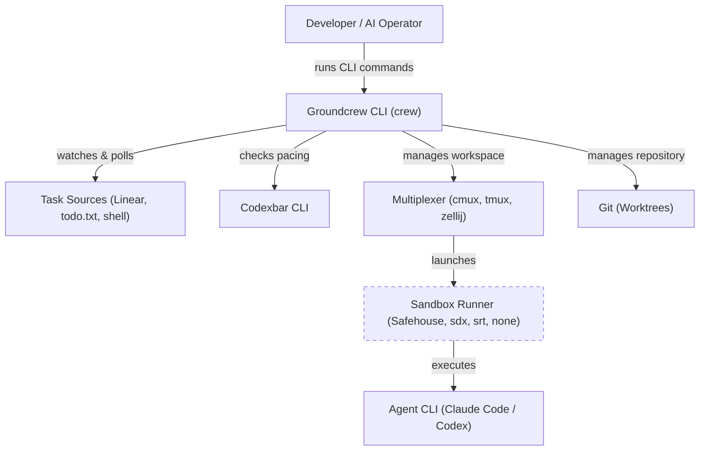
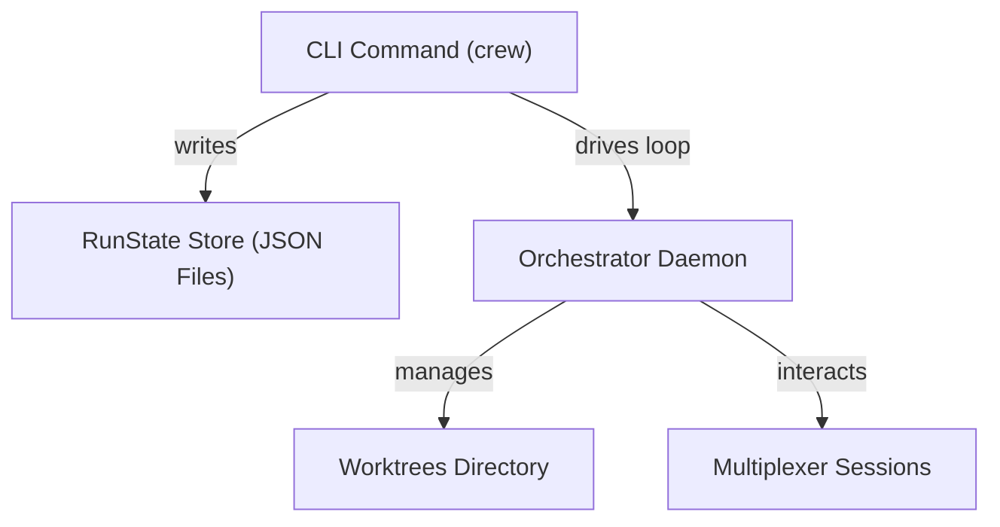
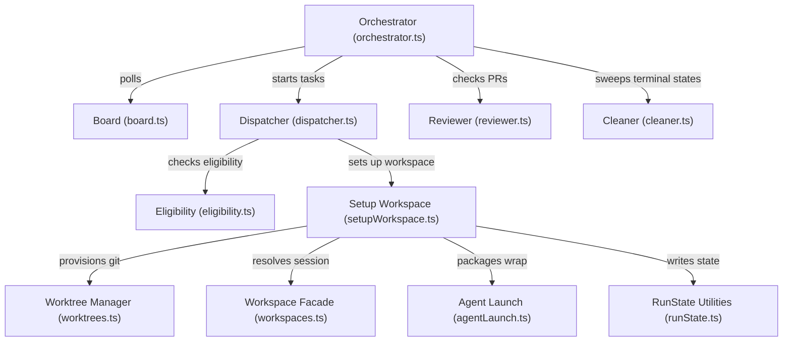
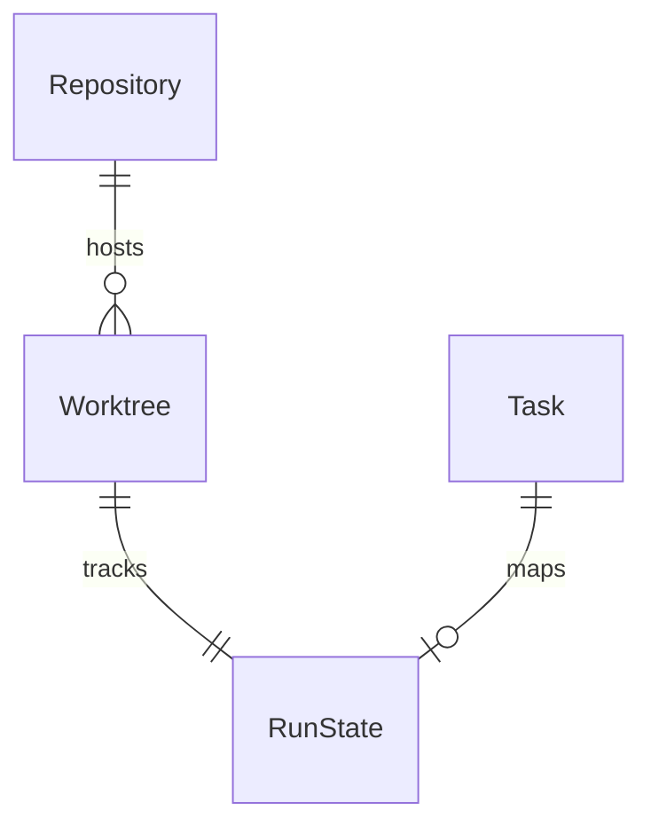

# Systems Design Specification: Groundcrew

**Owner:** Eduardo Romero  
**Audience:** All Engineering Levels & AI Agents  
**Status:** Code-Faithful & Fully Cited  
**Grounded In Commit:** `4.40.0` (from [package.json](groundcrew/package.json#L3))

---

## Phase 0: System Thesis & Substrate

### System Thesis

Groundcrew orchestrates parallel execution of local AI coding agents by polling task tracking systems, setting up
dedicated git worktrees to prevent concurrency conflicts, and launching agent processes inside terminal multiplexer
sessions wrapped in security sandboxes. Almost all complexity is centered on coordinating states (Todo, In-Progress,
In-Review, Done) across git, sandbox runners, multiplexers, and task sources without state divergence.

### Substrate

- **Execution Runtime:** Node.js `>= 24.14.1` (configured via [package.json:L103](groundcrew/package.json#L103)) using
  ECMAScript Modules (`"type": "module"`).
- **Core Orchestrator:** Command-based loop executing sequential poll ticks.
- **Datastore (Run State):** Local filesystem JSON files at
  `${XDG_STATE_HOME:-$HOME/.local/state}/groundcrew/runs/<normalizedTaskId>.json` (configured
  via [xdg.ts:L21](groundcrew/src/lib/xdg.ts#L21) and [runState.ts:L78](groundcrew/src/lib/runState.ts#L78)).
- **Integrations:**
    - **Task Sources:** Linear (via `@linear/sdk` [package.json:L73](groundcrew/package.json#L73)), local `todo.txt`
      files, and custom local shell executables.
    - **Terminal Multiplexers:** `cmux`, `tmux`, or `zellij` (detected
      via [workspaces.ts:L93-L110](groundcrew/src/lib/workspaces.ts#L93-L110)).
    - **Sandbox Runners:** Safehouse (macOS [localRunner.ts:L39](groundcrew/src/lib/localRunner.ts#L39)), Docker
      Sandboxes (`sbx` [localRunner.ts:L74](groundcrew/src/lib/localRunner.ts#L74)), Anthropic Sandbox Runtime (
      `srt` [localRunner.ts:L52](groundcrew/src/lib/localRunner.ts#L52)), or unsandboxed (
      `none` [localRunner.ts:L85](groundcrew/src/lib/localRunner.ts#L85)).
    - **Pacing Engine:** Codexbar CLI (probed via [usage.ts:L90-L109](groundcrew/src/lib/usage.ts#L90-L109)).

### Scope

- **In-Scope:**
    - Automated pooling/polling of task backlogs across multiple source systems.
    - Eligibility and usage pacing logic based on active limits.
    - Git worktree provisioning, branch generation, and automated code-checking lifecycle.
    - Composing and launching sandboxed agent environments.
    - Automated PR-driven status transitions (In-Progress → In-Review → Done).
- **Out-of-Scope:**
    - Sandbox provisioning/lifecycle (handled by `sbx` or system packages,
      per [ADR-0001](groundcrew/docs/adr/0001-groundcrew-uses-but-does-not-provision-sandboxes.md)).
    - Interactive agent execution (wrapped agent CLI handles input/output once launched).

---

## Phase 1: Structural Decomposition (C4)

### 1.1. System Context (Level 1)

#### Users & Roles

- **Developer / AI Operator:** Prepares backlog tasks, reviews generated PRs, resumes paused tasks, or triggers manual
  cleanup.
- **AI Agent CLI:** The process executing inside the sandbox (e.g., Claude Code, Codex).

#### External Systems

- **Linear API:** Remote task management system. Hard dependency for Linear sources.
- **Multiplexer (cmux / tmux / zellij):** Manages terminal sessions and session attachments.
- **Git:** Performs fetches, branch checkouts, worktree creation/pruning.
- **Codexbar:** External CLI tool queried via shell execution to read active agent usage limits.

#### Resilience & Graceful Degradation

- **Linear API down:** The orchestrator loop retries with exponential backoff (up to 3
  times, [orchestrator.ts:L32](groundcrew/src/commands/orchestrator.ts#L32)). If down permanently, it logs a warning and
  proceeds without polling that source.
- **Codexbar CLI down:** Groundcrew falls back to treating the affected agent as fully
  exhausted ([usage.ts:L206](groundcrew/src/lib/usage.ts#L206)) to prevent runaway usage.
- **Multiplexer down:** If cmux/tmux is unreachable, workspaces list as
  `unavailable` ([workspaceAdapter.ts:L47](groundcrew/src/lib/workspaceAdapter.ts#L47)). Groundcrew aborts
  cleanup/teardown steps to avoid deleting active folders.



---

### 1.2. Containers (Level 2)

- **CLI Core (`crew`):** Entry point of execution ([cli.ts](groundcrew/src/cli.ts)).
- **Orchestrator Daemon:** Long-running watch process triggered by
  `crew run --watch` ([orchestrator.ts:L172](groundcrew/src/commands/orchestrator.ts#L172)).
- **Run State Store:** On-disk directory storing run states as JSON
  documents ([runState.ts:L71](groundcrew/src/lib/runState.ts#L71)).
- **Worktree Directory:** Filesystem directory holding parallel checkouts (`~/dev/<repo>-<task>`).



#### Staff Challenge & Trade-offs

- **Single-Writer Constraint:** Groundcrew runs as a single-process orchestrator. Concurrency is safe because file
  operations on `RunState` use atomic write-then-rename
  transitions ([runState.ts:L163-L165](groundcrew/src/lib/runState.ts#L163-L165)). However, the scaling ceiling is
  dictated by the host machine's capacity (disk, CPU, memory) and API rate-limiting thresholds (Linear/GitHub).

---

### 1.3. Components (Level 3)



#### Interfaces & Interaction

- **Board:** Aggregates and normalizes raw issues from task source adapters ([board.ts](groundcrew/src/lib/board.ts)).
- **Dispatcher:** Applies budget checks and routes tasks to
  setup ([dispatcher.ts](groundcrew/src/commands/dispatcher.ts)).
- **Reviewer:** Scans active worktrees for pull requests ([reviewer.ts](groundcrew/src/commands/reviewer.ts)).
- **Cleaner:** Shuts down completed workspaces and deletes
  worktree/branches ([cleaner.ts](groundcrew/src/commands/cleaner.ts)).

---

## Phase 2: Domain & Data Modeling

### 2.1. Entity Catalog

#### Entity: RunState

- **Storage Path:** `${XDG_STATE_HOME:-$HOME/.local/state}/groundcrew/runs/<normalizedTaskId>.json`
- **Attributes:**
    - `task`: `string` (**Primary Key** - lowercase normalized task
      ID, [runState.ts:L192](groundcrew/src/lib/runState.ts#L192)).
    - `repository`: `string` (The target repository name, [runState.ts:L193](groundcrew/src/lib/runState.ts#L193)).
    - `agent`: `string` (Launching agent profile, [runState.ts:L194](groundcrew/src/lib/runState.ts#L194)).
    - `worktreeDir`: `string` (Absolute path to target git worktree on the
      host, [runState.ts:L195](groundcrew/src/lib/runState.ts#L195)).
    - `branchName`: `string` (Git branch name created for the
      run, [runState.ts:L196](groundcrew/src/lib/runState.ts#L196)).
    - `workspaceName`: `string` (Name of multiplexer
      session/window, [runState.ts:L197](groundcrew/src/lib/runState.ts#L197)).
    - `state`: `RunLifecycleState` (Enum:
      `"running" | "interrupted" | "resumed" | "failed-to-launch"`, [runState.ts:L7](groundcrew/src/lib/runState.ts#L7)).
    - `createdAt`: `string` (ISO 8601 creation timestamp, [runState.ts:L199](groundcrew/src/lib/runState.ts#L199)).
    - `updatedAt`: `string` (ISO 8601 last update timestamp, [runState.ts:L200](groundcrew/src/lib/runState.ts#L200)).
    - `resumeCount`: `number` (Non-negative integer, [runState.ts:L201](groundcrew/src/lib/runState.ts#L201)).
    - `reason`: `string` (Optional - description of interrupt
      reason, [runState.ts:L202](groundcrew/src/lib/runState.ts#L202)).
    - `detail`: `string` (Optional - launch failure detail, [runState.ts:L203](groundcrew/src/lib/runState.ts#L203)).
    - `title`: `string` (Optional - cached task title, [runState.ts:L204](groundcrew/src/lib/runState.ts#L204)).
    - `url`: `string` (Optional - cached task URL, [runState.ts:L205](groundcrew/src/lib/runState.ts#L205)).
    - `completionTaskId`: `string` (Optional - canonical ID for self-completion
      writebacks, [runState.ts:L206](groundcrew/src/lib/runState.ts#L206)).

- **State Transitions:**

```
[none] ──(setupWorkspace)──> running ──(stop)──> interrupted ──(resume)──> resumed
   │                             │
   │                             ├──(exit failure)──> failed-to-launch
   ▼                             ▼
 [none] <───(cleanupWorkspace)───┘
```

---

### 2.2. Domain Invariants

1. **Task Exclusivity:** A single task ID can have at most one active workspace/worktree at any time. Enforced by
   `worktrees.create` raising a
   `WorktreeAlreadyExistsError` ([worktrees.ts:L97](groundcrew/src/commands/setupWorkspace.ts#L97)).
2. **Concurrency Ceiling:** Active tasks (status `in-progress`) cannot exceed
   `maximumInProgress` ([dispatcher.ts:L216](groundcrew/src/commands/dispatcher.ts#L216)).
3. **Data Loss Guard:** Dirty worktrees (containing modified/untracked files) are rejected during cleanup/teardown
   unless explicitly overridden with `--force` ([worktrees.ts:L528-L536](groundcrew/src/lib/worktrees.ts#L528-L536)).
4. **Target Groundcrew Eligibility:** A task must resolve both a valid `agent` and `repository` to be eligible for
   dispatch ([taskSource.ts:L95](groundcrew/src/lib/taskSource.ts#L95)).

---

### 2.3. Entity Relationships



- **The "Terror of N":**
  Because worktrees are created on disk for every active task, `N` grows linearly with concurrent runs. Groundcrew
  manages compaction by executing automated teardowns when tasks reach a `done`
  state ([cleaner.ts:L68-L74](groundcrew/src/commands/cleaner.ts#L68-L74)) and offering the manual `crew cleanup <task>`
  utility ([cleanupWorkspace.ts:L63](groundcrew/src/commands/cleanupWorkspace.ts#L63)).

---

### 2.4. Transactional Boundaries

#### Unit 1: Workspace Provisioning (Sequential Steps)

1. **Resolve Eligibility:** Ensure slot headroom
   exists ([dispatcher.ts:L216](groundcrew/src/commands/dispatcher.ts#L216)).
2. **Create Git Worktree:** Spawn
   `git worktree add -b <branchName>` ([worktrees.ts:L305](groundcrew/src/lib/worktrees.ts#L305)).
3. **Stage Configuration:** Write staged files, workspace continuation notes, and secrets in a temporary prompt
   folder ([setupWorkspace.ts:L121-L164](groundcrew/src/commands/setupWorkspace.ts#L121-L164)).
4. **Open Session:** Launch the multiplexer
   session ([setupWorkspace.ts:L167](groundcrew/src/commands/setupWorkspace.ts#L167)).
5. **Write Run State:** Save state metadata atomically on the
   filesystem ([setupWorkspace.ts:L176-L188](groundcrew/src/commands/setupWorkspace.ts#L176-L188)).
6. **Mark in Source:** Transition task state to in-progress via adapter
   writeback ([setupWorkspace.ts:L151](groundcrew/src/commands/dispatcher.ts#L151)).

*Rollback Strategy:* If any step fails after worktree creation, `rollbackWorktree` is triggered to dismantle the
worktree and clean temporary directories ([setupWorkspace.ts:L197](groundcrew/src/commands/setupWorkspace.ts#L197)).

#### Unit 2: Workspace Teardown (Sequential Steps)

1. **Close Workspace:** Request multiplexer session
   termination ([worktrees.ts:L727](groundcrew/src/lib/worktrees.ts#L727)).
2. **Remove Worktree:** Remove worktree directory ([worktrees.ts:L741](groundcrew/src/lib/worktrees.ts#L741)).
3. **Delete Branch:** Delete local branch best-effort ([worktrees.ts:L437](groundcrew/src/lib/worktrees.ts#L437)).
4. **Clear Run State:** Delete RunState file ([cleaner.ts:L73](groundcrew/src/commands/cleaner.ts#L73)).

---

## Phase 3: Access Pattern Definition

### 3.1. Read Access Pattern Inventory (AP-XXX)

#### AP-101: Read Task RunState

- **Channel:** Node.js FS `readFileSync`
- **Lookup Key:** Task ID (`runs/<normalizedTaskId>.json`)
- **Frequency:** ~1 per command or tick invocation (configured poll loop)
- **SLA Latency:** `< 5ms` (measured - local file read)
- **Consistency:** Strong (Atomic file replacement makes read consistent)
- **Result Cardinality:** `0-1`

#### AP-102: List Active Worktrees

- **Channel:** Node.js FS `readdirSync` scanning `worktreeRoot` parents
- **Lookup Key:** Root path + Known Repositories
  list ([worktrees.ts:L318-L340](groundcrew/src/lib/worktrees.ts#L318-L340))
- **Frequency:** 1 per poll tick
- **SLA Latency:** `< 20ms` (measured)
- **Consistency:** Strong
- **Result Cardinality:** `0-N` bounded by filesystem directories

#### AP-103: Fetch Board State

- **Channel:** Source API (GraphQL HTTP for Linear / `fs` reads for todo.txt / subprocess execution for shell adapter)
- **Lookup Key:** Configured filter states (assigned tasks with `agent-*` labels)
- **Frequency:** 1 per poll tick (poll interval configured: default 30s)
- **SLA Latency:** `500 - 3000ms` depending on network/command execution (estimated)
- **Consistency:** Eventual (Source API reflects remote modifications eventually)
- **Result Cardinality:** `0-N` unbounded (paginated in chunks of 250 for
  Linear, [linear/fetch.ts:L23](groundcrew/src/lib/adapters/linear/fetch.ts#L23))

---

### 3.2. Write Pattern Inventory (WP-XXX)

#### WP-201: Record/Update RunState

- **Channel:** Node.js FS `writeFileSync` + `renameSync`
- **Operation:** INSERT / UPDATE
- **Concurrency Control:** Atomic
  write-to-temp-then-rename ([runState.ts:L163-L165](groundcrew/src/lib/runState.ts#L163-L165))
- **Durability:** Synchronous local commit
- **Side Effects:** Triggers log events

#### WP-202: Create Git Worktree

- **Channel:** Shell execute `git worktree add`
- **Operation:** INSERT
- **Concurrency Control:** Git locks repository indexes; concurrent setups for the same repo are serialized
  sequentially ([dispatcher.ts:L316](groundcrew/src/commands/dispatcher.ts#L316))
- **Durability:** Git index commit

#### WP-203: Close/Interrupt Workspace

- **Channel:** Shell execute tmux/cmux close commands
- **Operation:** DELETE / UPDATE

#### WP-204: Mark Task Status

- **Channel:** Source Writeback (GraphQL Mutation for Linear / File rewrite for todo.txt)
- **Operation:** UPDATE
- **Side Effects:** Moves ticket workflow states

---

### 3.3. Co-Access & Locality Patterns

Worktree directories and RunState metadata are local to the host. When running cleanup or setup commands, files inside
the temporary prompt directories are accessed together to load variables and launch commands.

---

### 3.4. Read/Write Characteristics Matrix

| Pattern                     | Frequency          | R:W        | Latency SLA           | Consistency | Volume | Selectivity     |
|-----------------------------|--------------------|------------|-----------------------|-------------|--------|-----------------|
| **RunState Read (AP-101)**  | `configured (30s)` | 100% Read  | `< 5ms (measured)`    | Strong      | Tiny   | High (Task Key) |
| **RunState Write (WP-201)** | `event-driven`     | 100% Write | `< 10ms (measured)`   | Strong      | Tiny   | High            |
| **Board Fetch (AP-103)**    | `configured (30s)` | 100% Read  | `~2000ms (estimated)` | Eventual    | Medium | Low             |

---

## Phase 4: Interface Definition (The Contract)

### 4.0. Authentication & Authorization Model

- **Task Source Credentials:** Provided via environment variables (e.g., `GROUNDCREW_LINEAR_API_KEY` or
  `LINEAR_API_KEY`). Stored raw in memory during daemon execution ([config.ts:L150](groundcrew/README.md#L150)).
- **Agent Sandbox Permissions:**
    - **Safehouse:** Uses clearance allowlists generated at rest or supplied via environment variables (
      `CLEARANCE_ALLOW_HOSTS_FILES` / `CLEARANCE_ALLOW_HOSTS`).
    - **Anthropic srt:** Sanitizes variables by running under clean baseline environment templates unless opted in via
      agent definitions ([runners.md:L52](groundcrew/docs/runners.md#L52)).

---

### 4.1. Canonical Route Map

Groundcrew exposes a CLI interface containing the following command
surface ([cli.ts:L157-L229](groundcrew/src/cli.ts#L157-L229)):

- `crew init`: Create `crew.config.ts` (supports `--global` or `--local`).
- `crew run`: Poll sources and start eligible tasks (supports `--watch` and `--dry-run`).
- `crew start <task>`: Launch one task immediately, bypassing eligibility filters.
- `crew doctor`: Verify host toolchain and configs.
- `crew source <list|verify>`: Inspect configured task sources.
- `crew task <list|get|create|done|validate>`: Interact directly with tasks on sources.
- `crew status [<task>]`: Print orchestrator state.
- `crew cleanup <task>`: Delete workspace and worktree (supports `--force`).
- `crew stop <task>`: Stop multiplexer session while keeping worktrees (supports `--reason`).
- `crew resume <task>`: Restart interrupted task with continuation prompt.
- `crew upgrade [<version>]`: Reinstall CLI globally via npm.

---

### 4.2. Commands (Write Side)

#### Command: StartWorkspace

- **Endpoint:** `crew start <task>`
- **Auth:** System user shell capability
- **Payload Schema:** String positional representing task ID
- **Success DTO:** Exit Code `0` + stdout logs detailing worktree creation
- **Error DTO:** Exit Code `1` + stderr detailing validation/checkout failure
- **Events Emitted:** `logEvent("dispatch", { outcome: "started" })`

---

## Phase 5: Failure Modes & Hard Limits

### 5.1. Hard Limits

- **Execution Slot Capacity:** Defaults to `1` concurrent task unless set via
  `orchestrator.maximumInProgress` ([config.ts](groundcrew/src/lib/config.ts)).
- **Codexbar Timeout:** Timeout window set to `30s` (configured via [usage.ts:L68](groundcrew/src/lib/usage.ts#L68)).
- **Polling Loop Heartbeat:** Watch loop delays tick cycles according to
  `orchestrator.pollIntervalMilliseconds` ([orchestrator.ts:L233](groundcrew/src/commands/orchestrator.ts#L233)).

---

### 5.2. Failure Scenarios

#### Scenario: Datastore Directory Writable Check Fails (Disk Full)

- **Impact:** Cannot record RunState updates. Workspaces will launch, but groundcrew loses track of them.
- **Detection:** Writes throw `ENOSPC` or similar file errors.
- **Behavior:** Logs error to console. Cleanup relies on manual multiplexer attachment and manual git prune commands.

#### Scenario: Git Index Lock in Source Repository

- **Impact:** Worktree checkout fails, blocking task setup.
- **Detection:** `git worktree add` returns exit code `128` with message including `index.lock`.
- **Behavior:** `setupWorkspace` catches error, triggers rollback, marks state as `failed-to-launch`, and proceeds to
  next task slot.

#### Scenario: External Dependency Outage (Linear API Down)

- **Impact:** Orchestrator cannot refresh task backlogs.
- **Detection:** HTTP fetch commands throw network errors.
- **Behavior:** Orchestrator retries up to 3 times, then sleeps until next tick window. Existing workspaces continue
  execution unaffected.

---

### 5.3. Blast Radius

Because Groundcrew runs on the host machine, a crash or resource exhaustion (CPU/Disk) in a multiplexer backend (like
tmux) can interrupt all active sandboxed agents simultaneously. However, because each task workspace has its own git
worktree and branch, codebase data corruption is strictly isolated; a crash inside task `A`'s workspace has zero ability
to write to task `B`'s files.

---

## Appendix A: Glossary

- **Worktree:** A Git feature enabling multiple checkouts of the same repository in distinct folders.
- **Clearance:** A proxy server gating agent network requests based on an allowlist of domains.
- **Multiplexer:** A CLI utility (tmux/cmux/zellij) hosting virtual terminal windows that run detached background
  processes.
- **RunState:** Local metadata tracking the current runtime state of launched tasks.
- **Pacing:** Gatekeeper checks verifying agent API usage balances are above threshold levels before dispatch.
