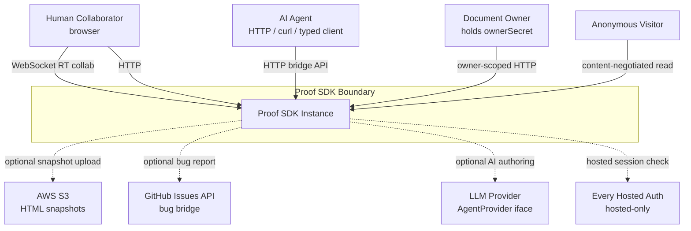
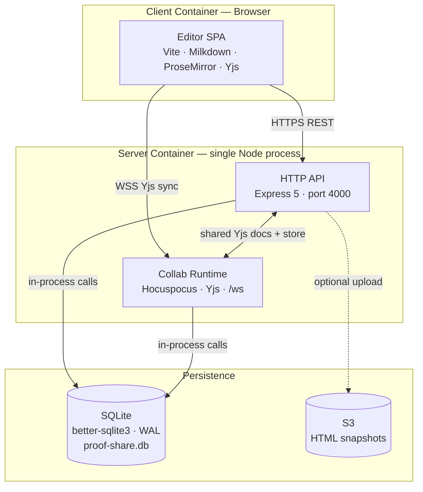
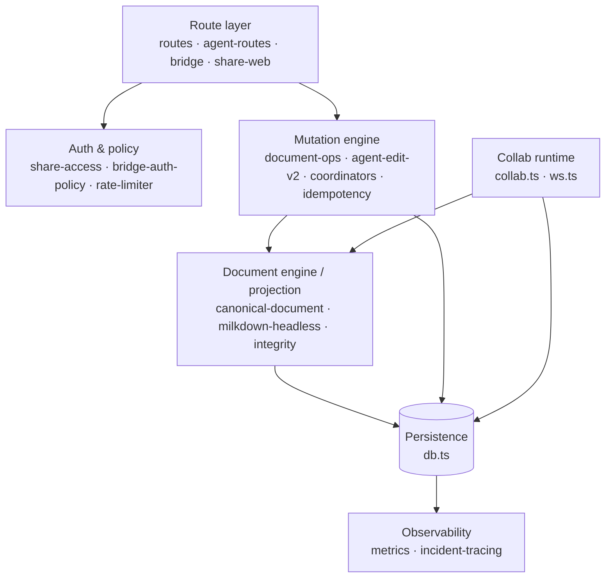
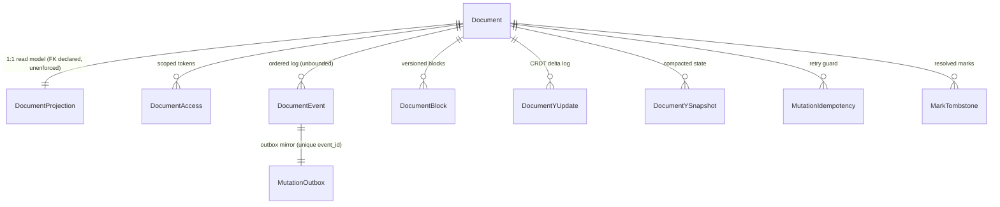

# Proof SDK — Systems Design Specification

**Owner:** Proof SDK maintainers
**Audience:** Engineers integrating with, operating, or extending [Proof SDK](https://github.com/EveryInc/proof-sdk)
**Status:** Reverse-engineered from the codebase (`proof-sdk`, v0.1.0)
**Method:** This document follows the *Systems Design Specification Standard (Staff Engineer Edition)* — C4 decomposition → domain/data model → access patterns → interface contract → failure modes.

> **What Proof SDK is, in one sentence:** an open-source, collaborative **markdown editor + realtime collab server + content-provenance model + agent HTTP bridge** that lets humans and AI agents co-edit the same document while tracking *who wrote what and whether it was reviewed*.

> **The one idea that explains the architecture:** the system keeps **two representations of every document in sync** — a CRDT (Yjs) that powers realtime browser editing, and a SQL **markdown projection** that powers stateless HTTP reads/writes by agents. Almost all complexity in this codebase exists to keep those two views convergent. ("Attestation follows meaning, not bytes" is the sibling idea on the provenance side.)

---

## Phase 0: Orientation (Repo Map)

The published surface is five thin workspace packages that **re-export** the real implementations in `server/` (Node/Express backend) and `src/` (browser editor + bridge protocol).

| Package | Re-exports from | Responsibility |
|---|---|---|
| `@proof/core` (`packages/doc-core`) | `src/formats/*`, `src/shared/agent-identity` | Provenance/marks data model, markdown ↔ provenance serialization, author-ID format |
| `@proof/editor` (`packages/doc-editor`) | `src/editor/*` | Milkdown/ProseMirror editor runtime + comment/mark/suggestion plugins |
| `@proof/server` (`packages/doc-server`) | `server/routes`, `server/agent-routes`, `server/bridge`, `server/collab` | Document/share/collab/agent Express routers + collab runtime |
| `@proof/sqlite` (`packages/doc-store-sqlite`) | `server/db` | SQLite-backed document store (CRUD, access tokens, events) |
| `@proof/agent-bridge` (`packages/agent-bridge`) | `src/bridge/bridge-routes` | Bridge route table (the protocol) + typed HTTP client for agents |

Entry points worth reading first: `server/index.ts` (HTTP+WS bootstrap), `server/db.ts` (schema + all persistence), `src/bridge/bridge-routes.ts` (agent protocol table), `docs/PROVENANCE-SPEC-v2.md` (provenance model), `AGENT_CONTRACT.md` + `docs/agent-docs.md` (the public HTTP contract).

---

## Phase 1: Structural Decomposition (C4)

### 1.1 System Context (Level 1)



> Dashed = non-critical external; failure degrades a feature, not the core. The only hard dependencies are the local SQLite file and the in-process collab runtime.

Proof SDK is the black box in the center. External actors:

**Users / clients**
- **Human collaborator (browser):** opens `/d/:slug`, edits live over WebSocket. Authenticated (hosted) or link-token.
- **AI agent (HTTP):** stateless client (curl / `web_fetch` / the typed `@proof/agent-bridge` client). Reads state, posts ops/edits/comments/suggestions, polls events. Never needs a browser.
- **Document owner:** holds the `ownerSecret`; can pause/resume/revoke/delete and perform owner-only actions.
- **Anonymous visitor:** can read a public/active doc via content negotiation on the share URL.

**External systems** (called, not controlled — must degrade gracefully)
- **AWS S3** (`@aws-sdk/client-s3`) — optional snapshot/artifact storage.
- **GitHub Issues API** — optional bug-report bridge (`server/bug-reporting.ts`, `PROOF_GITHUB_ISSUES_*`).
- **Every hosted auth provider** — hosted-only OAuth/session (`server/hosted-auth.ts`, `share_auth_sessions`). Out of scope for the open SDK (`auth_mode=none`).
- **LLM provider** — abstracted behind the `AgentProvider` interface (`packages/agent-bridge`); the SDK ships the protocol, not a bundled model.
- **Implicit dependencies:** local filesystem (SQLite WAL file `proof-share.db`), DNS, and the clock (token expiry / lease TTLs).

**Value flows:** agents and humans send intent (edits, comments, suggestions, presence); the system returns converged document state, provenance marks, and an ordered event stream.

> **Staff challenge — what if an external system is down for 4h?** S3/GitHub/LLM are all non-critical: their failure degrades a feature (snapshots, bug reports, AI authoring) but the editor and collab core keep working. The *only* hard dependency is the SQLite file and the collab runtime in-process.

### 1.2 Containers (Level 2)

Despite the package split, this deploys as **a single Node process plus one embedded data store** — deliberately monolithic for SDK portability.



| Container | Type | Responsibility | Protocol in |
|---|---|---|---|
| **HTTP API server** | Express 5 app (`server/index.ts`, port `4000`) | All REST: create, state, snapshot, edit, edit/v2, ops, presence, events, bridge | HTTPS/JSON, `text/markdown` |
| **Collab WebSocket runtime** | Hocuspocus/Yjs, embedded in the same process (`startCollabRuntimeEmbedded`, path `/ws`) | Realtime CRDT sync, presence/awareness, authoritative ProseMirror fragment | WebSocket (Yjs protocol) |
| **Editor web app (SPA)** | Vite-built Milkdown/ProseMirror bundle (`src/`, served `dist/`, dev port `3000`) | Browser editing UI, binds to collab via `y-prosemirror` | loads over HTTPS, edits over WS |
| **SQLite store** | `better-sqlite3`, WAL mode, file `proof-share.db` | Documents, projections, events, idempotency, Yjs update log/snapshots, tokens | in-process function calls |

> **Staff challenge — why is the collab runtime *embedded* rather than a separate service?** It shares the same Yjs documents and SQLite store as the HTTP layer, so co-location avoids cross-process CRDT coordination. Trade-off: you **cannot horizontally scale the WS layer independently** — `active_collab_connections` carries an `instance_id` column anticipating multi-instance, but the shipped default is single-process. This is the system's main scaling ceiling.

> **Why SPA over SSR?** Realtime collaborative editing needs a long-lived client with a CRDT in memory; SSR buys nothing here. A static snapshot HTML path (`server/snapshot.ts`) exists separately for share previews/SEO.

### 1.3 Components (Level 3)



Inside the HTTP API server (code boundaries, not deploy boundaries):

- **Route layer** — `routes.ts` (legacy `/api/*` + create + `/ops` + `/edit`), `agent-routes.ts` (`/documents/*` canonical SDK + `/edit/v2` + snapshot), `bridge.ts` + `bridge-routes.ts` (`/bridge/*` low-level mark ops), `share-web-routes.ts` (`/d/:slug` human + content-negotiated agent view), `discovery-routes.ts` (`/.well-known/agent.json`).
- **Auth & policy** — `share-access.ts`, `bridge-auth-policy.ts`, `cookies.ts`, `hosted-auth.ts` (hosted only), `rate-limiter.ts`.
- **Mutation engine** — `document-ops.ts`, `agent-edit-ops.ts` (`/edit`), `agent-edit-v2.ts` (block-level `/edit/v2`), `mutation-coordinator.ts` + `collab-mutation-coordinator.ts`, `mutation-stage.ts` (Stage A/B/C rollout), `mutation-idempotency.ts`, `rewrite-policy.ts` + `rewrite-validation.ts`.
- **Document engine / projection** — `document-engine.ts`, `canonical-document.ts`, `document-integrity.ts`, `milkdown-headless.ts` (server-side ProseMirror parse/serialize), `snapshot.ts`, `proof-mark-*.ts` (mark rehydration/repair/sync), `anchor-resolver.ts`.
- **Collab runtime** — `collab.ts` (Yjs↔ProseMirror, admission guards, quarantine), `ws.ts` (connection registry).
- **Persistence** — `db.ts` (everything).
- **Observability** — `metrics.ts`, `observability.ts`, `telemetry.ts`, `incident-tracing.ts`, `server_incident_events`.

Browser side (`src/`): `editor/` (ProseMirror integration + plugins), `bridge/` (collab-client, share-client, executor), `agent/` (in-browser agent orchestration — hosted feature), `formats/` (provenance serialization shared with server via `@proof/core`).

> **Staff challenge — why is the projection a distinct component from the route layer?** Because reads and writes touch *different* representations. Writes go through the mutation engine → Yjs/ProseMirror → re-serialized to the **`document_projections`** table; reads serve the projection. Keeping them separate is what makes "render-authoritative vs projection-authoritative" convergence states (`fragmentStatus` vs `markdownStatus`) expressible.

---

## Phase 2: Domain & Data Modeling

Source of truth: `server/db.ts` (`initDatabase`, lines ~997–1338) and `docs/PROVENANCE-SPEC-v2.md`.

### 2.1 Entity Catalog

```
Entity: Document
  - Table: documents
  - Identifying Attribute: slug (PK, short id from server/slug.ts); doc_id (UUID, UNIQUE) secondary
  - Attributes:
    - slug: text (PK)
    - doc_id: uuid (unique, stable external id)
    - title: text (optional)
    - markdown: text (required) — canonical content incl. embedded provenance comment
    - marks: text/json (required, default '{}') — comments/suggestions overlay
    - revision: int (default 1) — monotonic; optimistic-lock token for /edit/v2
    - y_state_version: int (default 0) — Yjs state generation
    - share_state: ACTIVE | PAUSED | REVOKED | DELETED (default ACTIVE)
    - access_epoch / collab_bootstrap_epoch / live_collab_access_epoch: int — invalidate live sessions on access change
    - active: int (legacy boolean mirror of share_state)
    - owner_id: text (optional)
    - owner_secret / owner_secret_hash: text — full-owner credential (hash retained, plaintext cleared by backfill)
    - created_at / updated_at / deleted_at: iso8601
  - Lifecycle: ACTIVE → PAUSED ↔ ACTIVE → REVOKED → DELETED (soft-delete via deleted_at + share_state)

Entity: DocumentProjection  (read model)
  - Table: document_projections (1:1 with Document via document_slug PK/FK)
  - Attributes: revision, y_state_version, markdown, marks_json, plain_text,
                health: healthy | projection_stale | quarantined, health_reason
  - Purpose: denormalized, render-ready view served to HTTP readers; plain_text powers search/preview

Entity: DocumentAccess  (link token / capability)
  - Table: document_access
  - Identifying Attribute: token_id (PK)
  - Attributes: document_slug (FK), role: viewer|commenter|editor|owner_bot, secret_hash, created_at, revoked_at
  - Lifecycle: created → (revoked_at set). Secrets stored hashed (sha256); compared timing-safe.

Entity: DocumentEvent  (ordered changelog)
  - Table: document_events
  - Identifying Attribute: id (autoincrement, doubles as the polling cursor)
  - Attributes: document_slug (FK), document_revision, event_type, event_data(json), actor,
                idempotency_key, mutation_route, tombstone_revision, created_at, acked_by, acked_at

Entity: MutationIdempotencyRecord
  - Table: mutation_idempotency (PK: idempotency_key + document_slug + route)
  - Attributes: response_json, request_hash, status_code, state: pending|completed,
                lease_expires_at, reservation_token, tombstone_revision, completed_at, last_seen_at
  - Purpose: retry-safety + reservation lease so concurrent retries don't double-apply

Entity: MutationOutbox
  - Table: mutation_outbox (mirrors events for reliable delivery; unique event_id)
  - Purpose: transactional-outbox pattern bridging SQL commit → event/collab delivery

Entity: MarkTombstone
  - Table: mark_tombstones (PK: document_slug + mark_id)
  - Attributes: status: accepted|rejected|resolved, resolved_revision, expires_at (TTL ~35 days)
  - Purpose: prevent resurrection of accepted/rejected/resolved marks during collab rehydration

Entity: DocumentBlock  (block index for /edit/v2)
  - Table: document_blocks (PK: document_id + block_id)
  - Attributes: ordinal, node_type, attrs_json, markdown_hash, text_preview,
                created_revision, last_seen_revision, retired_revision (soft retire)
  - Purpose: stable block refs (b1, b2…) so block-level edits survive reflow

Entity: Yjs update log + snapshots
  - Tables: document_y_updates (append-only update_blob log), document_y_snapshots (compacted state)
  - Purpose: durable CRDT history; rehydrate live doc / rebuild projection

Value objects (no independent identity)
  - ProvenanceSpan / Selector / Review / Source  — embedded YAML/JSON in Document.markdown (PROVENANCE-SPEC-v2)
  - Mark (comment | suggestion)                  — stored in Document.marks JSON overlay
  - ActiveCollabConnection                       — ephemeral presence row, TTL ~45s
  - ShareAuthSession                             — hosted-only

Author ID (value object, used everywhere as `by`/`actor`/`reviewer`):
  - AI:    ai:<model>[:version]   e.g. ai:claude, ai:claude:opus-4-5
  - Human: human:<name|email>     e.g. human:alice, human:alice@example.com
```

**Provenance model (the heart of `@proof/core`):** every span of text carries `origin` (`human` | `ai`), an AI-only `basis` (`described` | `inferred` | `suggested`), and a **stack of `reviews`** (`skimmed` | `flagged` | `approved`). Key rules: humans never have a `basis`; AI cannot `approve` its own content (only `skimmed`); reviews go **stale** when `reviewed_hash !== current content hash`. Spans are addressed by **semantic selectors** (content / anchor / quote / pattern / composite), with a cached `resolved` offset+hash for fast rendering. Persisted as a YAML (or legacy JSON) block in an HTML comment at the end of the markdown.

### 2.2 Entity Relationships



> **Referential integrity is application-enforced, not database-enforced.** Several tables *declare* `FOREIGN KEY ... REFERENCES documents(slug)` (`document_projections`, `events`, `document_access`, `document_events`, `document_y_updates`, `document_y_snapshots`, `library_documents`), but `getDb()` (`db.ts:487–490`) sets only `journal_mode=WAL`, `synchronous=NORMAL`, `busy_timeout=5000` — it **never** issues `PRAGMA foreign_keys = ON`, and SQLite leaves FK enforcement **off by default**. The FK declarations are therefore inert: SQLite will not block an orphan insert or cascade/restrict a delete. Integrity is upheld only by application code. (`mutation_idempotency`, `mutation_outbox`, `mark_tombstones`, `document_blocks`, `active_collab_connections`, `user_document_visits` declare no FK at all and reference documents by slug/id purely by convention.)

- Document **1:1** DocumentProjection — owning side Document; projection rebuilt from Yjs/markdown. FK *declared but unenforced*.
- Document **1:N** DocumentAccess — N small/bounded (a handful of tokens). FK *declared but unenforced*. Owner deletion → soft-delete; no cascade (deletion never removes child rows).
- Document **1:N** DocumentEvent — **N unbounded** (grows forever with activity). FK *declared but unenforced*. ⚠️ This is the "terror of N": always read with `after`/`limit` cursor; never `SELECT *`.
- Document **1:N** Yjs updates — **N unbounded**; bounded in practice by periodic snapshot compaction.
- Document **1:N** DocumentBlock — N ≈ block count; old blocks soft-retired via `retired_revision`. (No FK declared.)
- Document **1:N** MarkTombstone / MutationIdempotency / MutationOutbox — bounded by TTL/retention. (No FK declared.)
- DocumentEvent **1:1** MutationOutbox (unique `event_id` via partial unique index `idx_mutation_outbox_event_id_unique WHERE event_id IS NOT NULL`, `db.ts:1194`).

> **Staff challenge — delete a Document?** Soft delete: `share_state=DELETED` + `deleted_at`. Children (events, tokens, Yjs log) are retained — and because FK enforcement is off, nothing cascades or restricts at the DB level either way — so history and in-flight retries stay coherent. Hard purge is a separate maintenance concern (`maintenance_runs`).

### 2.3 Transactional Boundaries

The three atomic units, as procedural step sequences:

```
1. Document registration (WP-001)            [single SQLite transaction]
   a. INSERT documents
   b. INSERT document_access (owner / link token)
   c. upsert document_projections (initial)
   d. INSERT document_events (document.created) + mutation_outbox mirror

2. Collaborative sync mutation (WP-009)      [on Hocuspocus commit]
   a. read latest y_state_version
   b. INSERT document_y_updates (binary delta; reject if >8MB)
   c. re-derive + UPDATE documents markdown/marks/revision
   d. upsert document_projections
   e. enqueue event + outbox  (delivery is best-effort, async)

3. Agent surgical mutation (WP-002 / WP-004) [incoming REST]
   a. check/reserve mutation_idempotency (key+slug+route); replay if completed
   b. validate baseRevision (optimistic lock)
   c. apply ops to the Y.Doc, serialize via headless milkdown
   d. UPDATE documents + document_blocks + projection; INSERT outbox  [tx commit]
   e. converge live collab fragment (async → fragmentStatus)
```

- **Create document** (`createDocument`): single INSERT into `documents`; projection upsert + `document.created` event follow. Effectively atomic per row.
- **A mutation (`/edit/v2`, `/ops`)**: the hard case. Must atomically (a) advance `revision`, (b) update canonical markdown/marks, (c) write the projection, (d) enqueue the event/outbox row, **then** asynchronously (e) converge the live Yjs fragment. (a)–(d) run inside a SQLite transaction; (e) is best-effort and reported via `collab.fragmentStatus`. This is the **transactional-outbox** pattern: commit-then-deliver, so a collab hiccup never loses a persisted edit.
- **Consistency model:** SQL projection is **strong/read-your-writes** within the process (single SQLite writer, WAL). Live collab convergence is **eventual** — hence the explicit split: `collabApplied`/`fragmentStatus` (render) vs `markdownStatus` (projection).
- **Isolation:** `better-sqlite3` is synchronous with a single writer (`busy_timeout=5000`); `synchronous=NORMAL` favors availability over full fsync durability. Concurrency between agents is serialized by the idempotency reservation lease + revision check, not DB row locks.

> **Staff challenge — step (e) fails after (a)–(d) commit?** The edit is durable and visible to HTTP readers immediately; the outbox row + `fragmentStatus: pending` (HTTP `202`) tell the caller render convergence is still in flight. Recovery is replay from the outbox/Yjs log, not rollback.

---

## Phase 3: Access Pattern Definition

> Frequencies/SLAs below are **design intents inferred from the code** (rate-limit defaults, cursoring, caching), not measured production numbers. Treat them as the budget the design implies.

### 3.1 Read Access Pattern Inventory

```
AP-001: Read document state (HTTP)
  - Route: GET /documents/:slug/state   (also /api/.../open-context, /info)
  - Access Type: Point lookup (by slug) on document_projections
  - Frequency: High — every agent read-before-write
  - Latency SLA: <100ms p99 (single indexed row + serialize)
  - Consistency: Read-your-writes (serves committed projection)
  - Result Cardinality: 0–1
  - Pagination: n/a

AP-002: Read block snapshot (HTTP)
  - Route: GET /documents/:slug/snapshot
  - Access Type: Point lookup + ordered child fetch (document_blocks, live ordinals)
  - Returns: revision + ordered blocks[] with stable refs (b1,b2,…), clean markdown
  - Consistency: Read-your-writes (revision-tagged)
  - Result Cardinality: 0–N bounded (block count)

AP-003: Content-negotiated share read
  - Route: GET /d/:slug?token=...  with Accept: application/json | text/markdown | text/html
  - Access Type: Point lookup + auth resolution; returns markdown + _links + agent.auth hints
  - Consistency: Eventual (may serve snapshot/preview)
  - Result Cardinality: 0–1

AP-004: Poll pending events (HTTP)
  - Route: GET /documents/:slug/events/pending?after=<id>&limit=<n>
  - Access Type: One-to-many navigation, keyset/cursor on document_events.id
  - Sort Order: id ASC (after cursor)
  - Frequency: High (agents long-poll loops)
  - Latency SLA: <100ms p99 (covered by idx_document_events_slug_id)
  - Consistency: Read-your-writes
  - Result Cardinality: 0–N **unbounded total**, bounded per page (default page size 100)
  - Pagination: REQUIRED (cursor = last id)

AP-005: Read marks overlay (bridge)
  - Route: GET /documents/:slug/bridge/marks
  - Access Type: Point lookup; returns comments/suggestions array
  - Result Cardinality: 0–N bounded

AP-006: Live collab read (WebSocket)
  - Channel: /ws (Yjs sync + awareness)
  - Access Type: Streaming subscription to a document's CRDT
  - Consistency: Eventual/convergent (CRDT)
  - Cardinality: continuous stream; presence bounded by connected clients

AP-007: Capabilities / discovery / health
  - Routes: GET /api/capabilities, /.well-known/agent.json, /health
  - Access Type: Static/computed, point
  - Consistency: Eventual; cacheable
```

### 3.2 Write Pattern Inventory

```
WP-001: Create document
  - Route: POST /documents  (alias POST /share/markdown; legacy POST /api/documents)
  - Operation: INSERT documents (+ projection upsert, document.created event)
  - Affected: Document(1), DocumentProjection(1), DocumentEvent(1), DocumentAccess(0–1 owner/link)
  - Uniqueness: slug (PK), doc_id (UNIQUE)
  - Idempotency: not required (creates are intentional); ownerSecret returned once
  - Durability: immediate
  - Concurrency: n/a (new row)
  - Side Effects: emits document.created; returns ownerSecret + accessToken
  - Rate limit: 20/min unauth, 120/min authed (per bucket), window 60s

WP-002: Block-level edit (recommended)
  - Route: POST /documents/:slug/edit/v2
  - Operation: UPDATE document (revision++, markdown, marks, projection) + outbox + collab converge
  - Affected: Document(1), DocumentProjection(1), DocumentBlock(N), DocumentEvent(1)
  - Conditional: baseRevision MUST match (optimistic lock) → else 409 STALE_REVISION + latest snapshot
  - Concurrency: Optimistic locking on revision
  - Idempotency: Idempotency-Key recommended/required by stage (reservation lease)
  - Durability: SQL immediate; collab convergence async (fragmentStatus)
  - Side Effects: edit/mark events; live fragment update

WP-003: Structured edit
  - Route: POST /documents/:slug/edit  (operations[]: append|replace|insert-after, max 50)
  - Conditional: optional baseUpdatedAt optimistic lock → 409 STALE_BASE
  - Concurrency: last-write-wins unless baseUpdatedAt supplied
  - Else: as WP-002

WP-004: Ops (comment / suggestion / rewrite)
  - Route: POST /documents/:slug/ops   types:
      comment.add | comment.reply | comment.resolve
      suggestion.add | suggestion.accept | suggestion.reject
      rewrite.apply
  - Operation: UPDATE marks overlay (comments/suggestions) or full-doc replace (rewrite)
  - Idempotency: Idempotency-Key supported (retry-safe)
  - Concurrency: quote/selector anchoring against current snapshot; mark id stable
  - Side Effects: corresponding *.added/.resolved/.accepted/.rejected/.rewritten events
  - Special: rewrite.apply BLOCKED when authenticated live collaborators connected
            (LIVE_CLIENTS_PRESENT); force ignored in hosted env
  - Rate limit: 120/min default (PROOF_OPS_RATE_LIMIT_MAX)

WP-005: Presence
  - Route: POST /documents/:slug/presence (and /bridge/presence)
  - Operation: ephemeral upsert (no durable doc mutation)
  - Idempotency: not required; explicit-only (requires X-Agent-Id/agentId)
  - Durability: ephemeral (awareness), TTL ~45s

WP-006: Ack events
  - Route: POST /documents/:slug/events/ack   {upToId, by}
  - Operation: UPDATE document_events SET acked_by/acked_at WHERE id <= upToId
  - Idempotency: naturally idempotent (set-based)

WP-007: Lifecycle (owner-only)
  - pause/resume/revoke/delete via owner-authenticated routes
  - Operation: UPDATE share_state (+ access_epoch bump to evict live sessions)
  - Side Effects: document.paused/resumed/revoked/deleted; collab admission re-gated

WP-008: Title update
  - Route: PUT /documents/:slug/title  → UPDATE title; document.updated

WP-009: Live CRDT update (WebSocket)
  - Channel: /ws — Yjs update_blob appended to document_y_updates
  - Guard: OversizedYjsUpdateError if blob > 8MB (COLLAB_MAX_UPDATE_BLOB_BYTES)
  - Concurrency: CRDT merge (conflict-free); projection re-derived
```

### 3.3 Co-Access & Locality Patterns

```
Locality 1: Document read aggregate (AP-001)
  - Entities: Document + DocumentProjection (markdown, marks, plain_text)
  - Read freq: high; Update freq: per edit
  - Design: projection is the denormalization — pre-serialized markdown/marks/plain_text
            stored alongside so reads never re-run ProseMirror serialization
  - Trade-off: write amplification (every edit rewrites projection) bought for fast, safe reads

Locality 2: Snapshot aggregate (AP-002)
  - Entities: Document + DocumentBlock[] (live ordinals)
  - Design: idx_document_blocks_live_ordinal (partial, WHERE retired_revision IS NULL)
            gives ordered live blocks in one indexed scan

Locality 3: Event tail (AP-004)
  - Entities: DocumentEvent by (document_slug, id)
  - Design: covering index idx_document_events_slug_id; always cursor-bounded
```

### 3.4 Data Derivation & Aggregation

```
Derived 1: document_projections.markdown / marks_json / plain_text
  - Source: canonical Yjs/ProseMirror doc → milkdown-headless serialize
  - Update Trigger: every WP-002/003/004/009
  - Strategy: INCREMENTAL (write-time) — recomputed on each mutation, stored
  - Consistency: strong within process; health flag marks projection_stale/quarantined on drift
  - Staleness impact: stale projection = HTTP readers see old content → flagged + repaired
                      (proof-mark-repair, canonical-repair endpoints, projection_repair_total)

Derived 2: Provenance resolved offsets + content_hash
  - Source: resolve(selector, document) → offset; hash of resolved content
  - Strategy: ON-DEMAND with cache — hash match ⇒ use cache; mismatch ⇒ re-resolve (async)
  - Consistency: eventual; stale spans rendered with a visual marker

Derived 3: Review effective level + attestation coverage (humanPercent/aiPercent, A0–A4)
  - Source: fold review stack (highest non-stale wins; flagged takes precedence)
  - Strategy: ON-DEMAND at render

Derived 4: connectedClients / active collab breakdown
  - Source: active_collab_connections (TTL-pruned) + ws.ts registry
  - Strategy: INCREMENTAL with TTL; used to gate rewrite.apply
```

### 3.5 Read/Write Characteristics Matrix

| Pattern | Frequency (intent) | R:W | Latency SLA | Consistency | Volume | Selectivity |
|---|---|---|---|---|---|---|
| AP-001 state | High | read-heavy | <100ms p99 | RYW | 1 row | Point (indexed) |
| AP-002 snapshot | Medium | read-heavy | <150ms p99 | RYW | N blocks | Selective |
| AP-004 events poll | High | read-heavy | <100ms p99 | RYW | page≤100 | Selective (keyset) |
| AP-006 collab WS | Continuous | balanced | realtime | Convergent | stream | n/a |
| WP-002 edit/v2 | Medium | write | <300ms p99 | strong+async collab | 1 doc | Point |
| WP-004 ops | Medium | write | <300ms p99 | strong+async | 1 doc | Point |
| WP-001 create | Low | write | <300ms p99 | strong | 1 row | Point |

**What it tells you:** the projection table is the read hot path (index + denormalize, done). `document_events` is the unbounded table — it lives or dies on keyset pagination (it has it). The collab WS path is the realtime spine and the scaling ceiling (single process).

---

## Phase 4: Interface Definition (The Contract)

CQRS-ish: commands mutate, queries read, events notify. Auth precedes everything (§4.0).

### 4.0 Authentication & Authorization model

- **Credentials (returned by WP-001):**
  - `ownerSecret` — full-owner capability. Pause/resume/revoke/delete + owner-level mark ops. Store securely; never in UI.
  - `accessToken` — scoped link credential with a role: `viewer` | `commenter` | `editor` (`owner_bot` internal). Use for non-owner ops.
- **Presenting a token:** `Authorization: Bearer <token>` (preferred), or `x-share-token: <token>`, or `?token=` in the URL. Bridge mark-mutations also accept `x-bridge-token`.
- **Direct-share create auth** (`PROOF_SHARE_MARKDOWN_AUTH_MODE`): `none` (open, dev default) | `api_key` (require `PROOF_SHARE_MARKDOWN_API_KEY`) | `auto` (→ none in SDK).
- **Legacy `/api/documents`** governed separately by `PROOF_LEGACY_CREATE_MODE`: `allow` | `warn` | `disabled` | `auto`.
- **Bridge route auth** (`src/bridge/bridge-routes.ts`, each route carries an explicit `auth` field): `auth: none` for reads and *proposal/authoring* — `/state`, `/marks` (`bridge-routes.ts:167,173`), `/marks/comment`, `/comments`, `/marks/suggest-replace|suggest-insert|suggest-delete`, `/suggestions`, `/rewrite` (`:180–342`). `auth: 'bridge-token'` for **review / thread-resolution / presence** — `/marks/accept`, `/marks/reject`, `/marks/reply`, `/marks/resolve`, `/comments/reply`, `/comments/resolve`, `/presence` (`:286–355`). Note `/comments/reply` requires the token even though it is reply-shaped. Mirrors the provenance rule: anyone may propose, only authorized actors may accept/approve/resolve.
- **Secrets at rest:** sha256-hashed (`owner_secret_hash`, `document_access.secret_hash`), compared with `timingSafeEqual`. Plaintext `owner_secret` is cleared by backfill once hashed.
- **Session eviction:** changing share_state/role bumps `access_epoch` / `collab_bootstrap_epoch`, invalidating live collab tokens.

### 4.1 Commands (Write Side)

```
Command: CreateDocument            (maps WP-001)
  - POST /documents
  - Payload (JSON): { markdown, title?, role?: viewer|commenter|editor, ownerId? }
    or raw: Content-Type: text/markdown + ?title=&role=
  - Auth: per PROOF_SHARE_MARKDOWN_AUTH_MODE
  - Idempotency: none (intentional create)
  - Success 200: { success, slug, docId, url, shareUrl, tokenUrl, ownerSecret,
                   accessToken, accessRole, shareState, snapshotUrl, createdAt, _links }
  - Errors: 401 (api_key mode), 429 RATE_LIMITED
  - Events: document.created

Command: ApplyBlockEdit            (maps WP-002) — RECOMMENDED
  - POST /documents/:slug/edit/v2
  - Headers: Authorization; Idempotency-Key (X-Idempotency-Key accepted)
  - Payload: { by, baseRevision (REQUIRED), operations: [
      {op: replace_block, ref, block:{markdown}},
      {op: insert_after, ref, blocks:[{markdown}]}, ...] }
  - Precondition: baseRevision === current revision (baseUpdatedAt NOT accepted here)
  - Success 200: { revision, snapshot, collab:{status,fragmentStatus,markdownStatus} }
  - Success 202: fragment convergence pending
  - Errors: 409 STALE_REVISION (+latest snapshot), 400 BASE_REVISION_REQUIRED,
            409 IDEMPOTENCY_KEY_REQUIRED | IDEMPOTENCY_KEY_REUSED
  - Events: edit.* / mark events

Command: ApplyStructuredEdit       (maps WP-003)
  - POST /documents/:slug/edit
  - Payload: { by, baseUpdatedAt?, operations:[{op:append,section,content}|
              {op:replace,search,content}|{op:insert,after,content}] }  (max 50)
  - Success 200: { success, slug, updatedAt, collabApplied, collab:{...}, presenceApplied }
  - Errors: 409 STALE_BASE (+retryWithState), 400 INVALID_OPERATIONS (e.g. insert "before"),
            404 ANCHOR_NOT_FOUND (auto-falls back to tag-stripped text match)

Command: ApplyOp                   (maps WP-004)
  - POST /documents/:slug/ops
  - Headers: X-Agent-Id (for presence), Idempotency-Key (recommended)
  - Payload by type:
      {type:comment.add, by, quote|selector, text}
      {type:comment.reply, by, markId, text}
      {type:comment.resolve, markId}
      {type:suggestion.add, by, kind:insert|delete|replace, quote, content?, status?:accepted}
      {type:suggestion.accept|reject, markId}
      {type:rewrite.apply, by, content, force?}
  - Success: { success, mark? } or rewrite result
  - Errors: quote_not_found (+nextSteps), validation_error, 409 LIVE_CLIENTS_PRESENT
            (rewrite only; +retryWithState, forceIgnored), REWRITE_BARRIER_FAILED (retryable)
  - Events: comment.added/replied/resolved, suggestion.accepted/rejected, document.rewritten

Command: SetPresence (WP-005) · AckEvents (WP-006) · UpdateTitle (WP-008)
  - POST /documents/:slug/presence  { status, agentId, summary?, name?, color? }
  - POST /documents/:slug/presence/disconnect          (clear presence)   [agent-routes.ts:3083]
  - POST /documents/:slug/events/ack  { upToId, by }
  - PUT  /documents/:slug/title  { title }   (owner/editor)              [routes.ts:1213]

Command: Lifecycle (WP-007, owner-only via ownerSecret)
  - POST /documents/:slug/pause | /resume | /revoke    [routes.ts:1813/1836/1857]
  - DELETE /documents/:slug                 (soft-delete)        [routes.ts:1787]
  - effect: share_state transition + access_epoch bump (evicts live sessions)
  - Events: document.paused/resumed/revoked/deleted
```

**Full route surface (beyond the canonical SDK set).** These owner/admin and CRUD endpoints exist in `server/routes.ts` and are part of the contract even though the README highlights only the canonical agent routes:

| Route | Purpose | Source |
|---|---|---|
| `GET /documents/:slug` | Content-negotiated full read (JSON / `text/markdown`) | `routes.ts:1159` |
| `PUT /documents/:slug` | Full-document update | `routes.ts:1289` |
| `DELETE /documents/:slug` | Soft-delete (`share_state=DELETED`, `deleted_at`) | `routes.ts:1787` |
| `POST /documents/:slug/delete` | Soft-delete alias (same effect as `DELETE`) | `routes.ts:1881` |
| `POST /documents/:slug/access-links` | Mint a new scoped (`viewer`/`commenter`/`editor`) link token | `routes.ts:890` |
| `POST /documents/:slug/pause` · `/resume` · `/revoke` | Lifecycle transitions (owner) | `routes.ts:1813/1836/1857` |
| `GET /documents/:slug/info` | Document metadata | `routes.ts:1905` |
| `GET /documents/:slug/open-context` | Open-context + capabilities (read path of AGENT_CONTRACT) | `routes.ts:1924` |
| `GET /documents/:slug/collab-session` | Collab session descriptor (ws url + token) | `routes.ts:2068` |
| `POST /documents/:slug/collab-refresh` | Refresh collab token before expiry | `routes.ts:2016` |
| `POST /api/auth/start` · `GET /api/auth/poll/:requestId` · `GET /api/auth/callback` · `POST /api/auth/logout` | Hosted Every OAuth (hosted-only; out of scope for `auth_mode=none`) | `routes.ts:938/980/982/1005` |

**Agent-router surface (`server/agent-routes.ts`, mounted at `/documents` and `/api/agent`).** Beyond `state`/`snapshot`/`edit`/`edit/v2`/`ops`/`presence`/`events` already covered, these exist and are part of the contract:

| Route | Purpose | Source |
|---|---|---|
| `POST /documents/:slug/presence/disconnect` | Explicitly clear presence (emits `agent.disconnected`) | `agent-routes.ts:3083` |
| `POST /documents/:slug/rewrite` | Dedicated full-document rewrite (distinct from `/ops` `rewrite.apply`) | `agent-routes.ts:3642` |
| `POST /documents/:slug/quarantine` | Mark/clear projection quarantine (integrity admin) | `agent-routes.ts:2146` |
| `POST /documents/:slug/repair` | Trigger projection/mark repair | `agent-routes.ts:3837` |
| `POST /documents/:slug/clone-from-canonical` | Rebuild projection from canonical Yjs doc | `agent-routes.ts:3873` |
| `POST /documents/:slug/marks/comment` | Add comment mark (granular agent mark API) | `agent-routes.ts:3396` |
| `POST /documents/:slug/marks/suggest-replace` · `suggest-insert` · `suggest-delete` | Add typed suggestion marks | `agent-routes.ts:3418/3440/3462` |
| `POST /documents/:slug/marks/accept` · `reject` | Resolve a suggestion | `agent-routes.ts:3484/3553` |
| `POST /documents/:slug/marks/reply` · `resolve` · `unresolve` | Comment-thread review actions | `agent-routes.ts:3576/3598/3620` |
| `GET /api/agent/bug-reports/spec` · `POST /api/agent/bug-reports` · `POST /api/agent/bug-reports/:issueNumber/follow-up` | GitHub-Issues bug bridge (`server/bug-reporting.ts`) | `agent-routes.ts:1698/1705/1812` |

> **Idempotency walkthrough (`/edit/v2` retry):** client sends `Idempotency-Key: K`. Server reserves `(K, slug, route)` in `mutation_idempotency` with `state=pending` + a lease (`PROOF_IDEMPOTENCY_PENDING_LEASE_MS`). On success it stores `state=completed` + `response_json` + `request_hash`. A retry with the same K and same payload hash returns the stored response (no re-apply); a retry with a **different** payload hash → `IDEMPOTENCY_KEY_REUSED`. A concurrent retry while `pending` is held off by the lease.

> **Staff challenge — commands return full snapshots, not just an id. Why?** Deliberate coupling: agents are stateless and almost always need the post-edit `revision`+blocks to issue their *next* edit. Returning the snapshot saves an immediate AP-002 round-trip. The cost (write/read coupling) is accepted because the agent workflow is inherently read-modify-write.

### 4.2 Queries (Read Side)

```
Query: GetState                    (maps AP-001)
  - GET /documents/:slug/state
  - Params: slug (path); Authorization/token
  - Response 200: { markdown, marks, revision, updatedAt, connectedClients,
                    contract:{mutationStage, idempotencyRequired, preconditionMode},
                    agent:{...hints}, _links }
  - Caching: none server-side; revision/updatedAt let clients cache
  - Consistency: read-your-writes
  - Errors: 404, 403, 410 (revoked/deleted)

Query: GetSnapshot                 (maps AP-002)
  - GET /documents/:slug/snapshot → { revision, blocks:[{ref,type,markdown}] }
  - Use before /edit/v2; refs are stable across the revision

Query: ResolveShareLink            (maps AP-003)
  - GET /d/:slug?token=...  (content negotiation)
    Accept: application/json → { markdown, _links, agent:{auth} }
    Accept: text/markdown   → raw markdown
    Accept: text/html       → editor SPA / snapshot preview

Query: GetMarks (AP-005) → GET /documents/:slug/bridge/marks → { success, marks[] }
Query: GetPendingEvents (AP-004) → GET /documents/:slug/events/pending?after&limit
        → { events:[{id,event_type,event_data,actor,created_at}], nextCursor }
Query: Capabilities/Discovery/Health (AP-007)
        → GET /api/capabilities · /.well-known/agent.json · /health
```

> **DTO discipline:** HTTP responses are deliberately *not* the row shape — secrets (`owner_secret_hash`), internal health columns, Yjs blobs, and outbox bookkeeping never appear in `state`/`snapshot` payloads. `_links`/`agent` hints are HATEOAS-style so agents discover the next call.

> **Pagination:** events use **keyset/cursor** (`after=<lastId>`), which is stable under concurrent inserts — the correct choice for an append-only, unbounded log. There is no offset pagination anywhere.

### 4.3 Events (Side Effects)

```
Event family: <noun>.<pastTense>   (document_events.event_type)
  Triggered by the commands in §4.1; delivered via:
    - HTTP polling  GET /events/pending  (pull, at-least-once, client acks)
    - Live collab   WS awareness/sync    (push)
  Backed by: mutation_outbox (transactional outbox; unique event_id) for reliable
             commit→deliver hand-off.

  - document.created / updated / paused / resumed / revoked / deleted / rewritten
  - comment.added / replied / resolved / unresolved
  - suggestion.<kind>.added  (kind ∈ insert|delete|replace) — e.g. suggestion.insert.added
        [document-engine.ts:1817, 2085]  (NOT a flat "suggestion.added")
  - suggestion.<status>      (status ∈ accepted|rejected) — accept/reject outcome
        [document-engine.ts:1967, 2205, 2282, 2372]
  - agent.edit               [agent-routes.ts:2921]   — structured /edit applied
  - agent.presence           [agent-routes.ts:1058, 3049]
  - agent.disconnected       [agent-routes.ts:3127]   — presence cleared

  (Note: `edit.request` is NOT an emitted event — it is only a presence call-source
   label passed to ensureAgentPresenceForAuthenticatedCall at agent-routes.ts:2432.
   The structured /edit path emits `agent.edit`.)

Delivery Guarantee: AT-LEAST-ONCE (poll + outbox); consumers dedupe via event id cursor
Ordering Guarantee: PER-DOCUMENT, total order by document_events.id (monotonic)
Partition Key:      document_slug
Payload:            { id, event_type, event_data(json), actor, document_revision,
                      tombstone_revision?, created_at }   (id is also the cursor)
Consumers:          - Agent poll loops      (GET /events/pending, ack by id)
                    - WebSocket broadcast   (push converged update to room subscribers)
                    - S3 snapshot publisher (render HTML → upload <slug>.html)
                    - Metrics / incident tracing
```

**Snapshot publisher pipeline** (`server/snapshot.ts`): on document change the server renders a static HTML view and, if `SNAPSHOT_S3_BUCKET` (+ `SNAPSHOT_S3_REGION/ENDPOINT/ACCESS_KEY_ID/SECRET_ACCESS_KEY/PREFIX`) is configured, uploads `<keyPrefix>/<slug>.html` via `PutObjectCommand`. This is the `snapshotUrl` returned by `CreateDocument`. The upload is **best-effort and non-blocking**: an S3 outage logs/telemeters and leaves the committed edit untouched (see §5.2).

> **Staff challenge — commit succeeds but delivery fails?** That's exactly why `mutation_outbox` exists: the event row is committed in the same transaction as the mutation, then delivered/marked `delivered_at` separately. A crash between commit and deliver is recovered by re-scanning undelivered outbox rows — no lost notifications, at-least-once to pollers.

> **Why per-document (not global) ordering?** Agents reason about one document at a time and the cursor is per-slug; global ordering would add coordination cost with no consumer benefit. `tombstone_revision` lets late/duplicate mark events be ignored after a mark is accepted/rejected/resolved.

---

## Phase 5: Failure Modes & Hard Limits

### 5.1 Hard Limits

| Limit | Value | Source |
|---|---|---|
| HTTP JSON body | 10 MB | `express.json({limit:'10mb'})` (`server/index.ts:48`) |
| Yjs update blob | 8 MB (`COLLAB_MAX_UPDATE_BLOB_BYTES`) | `OversizedYjsUpdateError` (`db.ts:43`) |
| Structured edit ops | 50 per request | `/edit` contract |
| Create rate limit | 20/min unauth, 120/min auth (60s window) | `routes.ts:110–112` |
| Ops rate limit | 120/min (`PROOF_OPS_RATE_LIMIT_MAX`, 60s) | `routes.ts:114–119` |
| Rate-limit bucket cap | 10,000 buckets (LRU-evicted) | `routes.ts:113` |
| SQLite busy timeout | 5,000 ms; WAL; `synchronous=NORMAL` | `db.ts:487–489` |
| Active collab connection TTL | ~45 s (prune every ~10 s) | `db.ts:40–42` |
| Idempotency pending lease | `PROOF_IDEMPOTENCY_PENDING_LEASE_MS` | `mutation-idempotency.ts` |
| Mark tombstone retention | ~35 days | `db.ts:28` |
| Event page size | 100 default | `db.ts:19` |
| Rewrite collab-write timeout | 3,000 ms (`PROOF_REWRITE_COLLAB_TIMEOUT_MS`) | `agent-routes.ts:146`, `agent-edit-v2.ts:123` |
| Rewrite safety-barrier timeout | 5,000 ms (`PROOF_REWRITE_BARRIER_TIMEOUT_MS`) | `agent-routes.ts:147`, `bridge.ts:52` |
| Collab stability sample interval | 100 ms (`stabilityMs` window default 0 = off) | `collab-mutation-coordinator.ts:229` |

> **Staff challenge — 10× traffic, what breaks first?** The single SQLite **writer** (all mutations serialize through it) and the single-process collab runtime (CPU for Yjs↔ProseMirror conversion). Reads scale fine (WAL readers + indexed projection). The pressure-relief valves are the rate limiters (HTTP 429) and the per-doc admission/quarantine guards.

### 5.2 Failure Scenarios

```
Scenario: Concurrent edit (stale base)
  - Impact: two writers race the same revision
  - Detection: baseRevision/baseUpdatedAt mismatch
  - Behavior: 409 STALE_REVISION / STALE_BASE + latest snapshot (retryWithState)
  - Recovery: client re-reads snapshot, re-applies, retries (idempotency-keyed)

Scenario: Retry storm / duplicate mutation
  - Impact: same op submitted N times (network retries)
  - Detection: mutation_idempotency reservation (key+slug+route, request_hash)
  - Behavior: replay stored response; IDEMPOTENCY_KEY_REUSED if payload differs;
              pending lease serializes concurrent retries
  - Recovery: safe by construction

Scenario: rewrite.apply while humans are live
  - Impact: would clobber in-flight collaborative edits
  - Detection: connectedClients > 0 (authenticated) via active_collab_connections
  - Behavior: 409 LIVE_CLIENTS_PRESENT (force ignored in hosted); retryable + nextSteps
  - Recovery: use /edit or /edit/v2 (collab-safe), or wait for disconnect

Scenario: Projection drift / corruption
  - Impact: HTTP markdown diverges from canonical Yjs fragment
  - Detection: document_integrity checks; projection.health=projection_stale|quarantined;
              metrics projection_drift_total / projection_guard_block_total
  - Behavior: serve guarded/repaired content; quarantine blocks unsafe reads
  - Recovery: proof-mark-repair, canonical-repair endpoints, marks-range-backfill

Scenario: Collab convergence fails after SQL commit
  - Impact: edit persisted but live fragment not yet updated
  - Detection: collab.fragmentStatus=pending → HTTP 202
  - Behavior: edit is durable & HTTP-visible; outbox + Yjs log drive convergence
  - Recovery: retry/replay; COLLAB_SYNC_FAILED surfaced for rewrite path only

Scenario: Oversized payload
  - Impact: memory/DoS risk
  - Behavior: reject >10MB HTTP body; OversizedYjsUpdateError for >8MB CRDT update

Scenario: Rate limit exceeded
  - Behavior: 429 RATE_LIMITED { limit, retryAfter }

Scenario: Wrong-environment database
  - Impact: dev process pointed at prod DB (or vice versa)
  - Detection: system_metadata.db_environment vs runtime (PROOF_ENV/NODE_ENV)
  - Behavior: refuse startup/writes unless ALLOW_CROSS_ENV_WRITES=1 (unsafe override)

Scenario: External system down (S3 / GitHub / LLM / hosted auth)
  - Behavior: degrade the dependent feature only; editor + collab core unaffected

Scenario: S3 snapshot upload fails
  - Impact: static HTML snapshot (snapshotUrl) not refreshed
  - Detection: PutObjectCommand rejects / times out
  - Behavior: non-blocking — committed edit untouched; logged/telemetered, no retry hang
  - Recovery: next successful mutation re-renders and re-uploads

Scenario: Hosted auth (Every OAuth) down  [hosted only]
  - Impact: new collab sessions cannot authenticate
  - Detection: session/OAuth check fails
  - Behavior: existing clients keep collaborating within their current access_epoch;
              new sessions rejected (401/403)
  - Recovery: transparent once provider recovers; SDK default auth_mode=none unaffected

Scenario: Document deleted / revoked read
  - Behavior: GET returns 410 (deleted) or 403 (revoked / not accessible)  [routes.ts:2028/2035/2039]

Scenario: Document paused/revoked/deleted
  - Behavior: mutations blocked by share_state; access_epoch bump evicts live sessions;
              reads return appropriate 403/410
```

> **Blast radius:** a SQLite outage or collab-runtime crash takes down the whole single process (everything shares them). External-dependency outages are contained to their feature. The deliberate isolation seams are: external systems behind interfaces, and the projection/collab split that keeps HTTP writes durable even when realtime convergence stalls.

---

## Appendix A: Glossary

- **Projection** — the SQL read-model (`document_projections`) re-derived from the canonical doc on every write.
- **Canonical document / fragment** — the authoritative Yjs/ProseMirror representation; live collab edits it.
- **Mark** — a comment or suggestion overlay (separate from provenance spans).
- **Provenance span** — a tracked region with origin/basis/review, addressed by a semantic selector.
- **Tombstone** — a record that a mark was accepted/rejected/resolved, preventing its resurrection.
- **Outbox** — transactional-outbox rows bridging committed mutations to event/collab delivery.
- **Access epoch** — counter bumped on access changes to invalidate live collab tokens.
- **fragmentStatus vs markdownStatus** — render (Yjs) convergence vs projection (SQL) convergence.
- **Stage A/B/C** — mutation-contract rollout controlling whether idempotency keys / base revisions are required (`contract.mutationStage`).

## Appendix B: Self-check (per the Standard)

✅ External dependencies — S3, GitHub, LLM provider, hosted auth, SQLite file, clock.
✅ Entities & relationships — Document + projection/access/events/idempotency/outbox/tombstone/blocks/Yjs log (§2).
✅ Read/write patterns — AP-001..007, WP-001..009 (§3).
✅ SLAs & consistency — projection RYW/strong, collab eventual; matrix in §3.5.
✅ Public API contract — commands/queries/events + auth (§4).
✅ Failure behavior — §5.

> ⚠️ Numbers labeled "intent" are inferred from rate limits and code structure, not measured. Validate against production telemetry (`metrics.ts`, AppSignal) before treating them as SLOs.

### Audit corrections (zero-divergence pass, 2026-06-14)

This spec was re-verified against the code. Corrected divergences:

1. **Foreign-key enforcement (§2.2).** Earlier text claimed "FK enforced." Reality: FK constraints are *declared* in DDL but SQLite does **not** enforce them — `getDb()` (`db.ts:487–490`) never runs `PRAGMA foreign_keys = ON`. Referential integrity is application-enforced only. Corrected the relationship bullets, the ER-diagram label, and the delete staff-challenge.
2. **`suggestion.added` event (§4.3).** No such event is emitted. Code emits `suggestion.<kind>.added` (`insert|delete|replace`, `document-engine.ts:1817,2085`) and `suggestion.<status>` for accept/reject. Corrected.
3. **Event catalog (§4.3).** Added the actually-emitted `agent.edit` (`agent-routes.ts:2921`), `agent.presence` (`:1058,3049`), `agent.disconnected` (`:3127`). Demoted `edit.request`, which is **not** an emitted event — only a presence call-source label (`agent-routes.ts:2432`).
4. **Incomplete route surface (§4.1).** Added the agent-router endpoints `/rewrite`, `/quarantine`, `/repair`, `/clone-from-canonical`, the granular `/marks/*` API, the `POST /documents/:slug/delete` alias, `/info`, `/open-context`, `/collab-session`, `/collab-refresh`, the hosted `/api/auth/*` routes, and the `/api/agent/bug-reports*` bridge.
5. **Bridge auth nuance (§4.0).** `/comments/reply` requires `bridge-token` (was implied open); refined the propose-vs-review split against `bridge-routes.ts` `auth` fields.

Verified-accurate (no change needed): all §5.1 hard-limit values and citations; rate-limit values (`routes.ts:110–115`); rewrite/barrier timeouts (`agent-routes.ts:146–147`, `agent-edit-v2.ts:123`); enum values for `ShareState`/`ShareRole` (`share-types.ts`); `CreateDocument` 200 status; event page size 100 (`db.ts:19`); 8 MB Yjs blob / 10 MB HTTP body limits.
