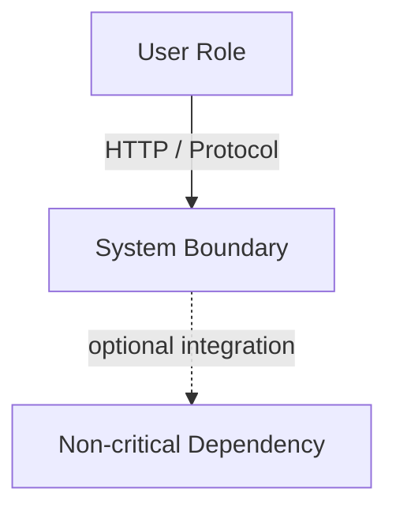

# Systems Design Specification Standard (Staff Engineer Edition)

**Owner:** Engineering Leadership
**Audience:** All Engineering Levels & AI Agents
**Goal:** Enforce "thinking before coding." Document intent (what and why) before implementation (how), and keep every claim grounded in a verifiable source of truth so the document stays trustworthy.

> **A spec is only useful if it is true.** A confident, well-formatted spec that contains one fabricated number or one assumed behavior is *worse* than no spec — it gets trusted and propagated. Read **§0 Evidence & Authoring Discipline before writing a single line.**

---

## §0. Evidence & Authoring Discipline (read first)

These rules are non-negotiable in either mode this standard is used: **designing a new system** (the source of truth is an explicit, agreed engineering decision) or **documenting an existing one** (the source of truth is the code, config, and migrations). The most common failure of humans and AI agents alike is **writing plausible fiction** — inventing throughput numbers, assuming a delete cascades, specifying a response shape that was never verified or decided.

1. **Ground every claim.** Every entity, route, limit, status code, and behavior must trace to a source of truth — verified for an existing system, deliberately decided for a new one. No source → don't assert it; record it as open instead.
2. **Never fabricate numbers.** Frequencies, latencies (p50/p95/p99), QPS, and SLAs are *measurements or targets*, never décor. If a number is neither measured nor deliberately chosen, mark it `(estimate)` or `(UNKNOWN — needs data)`. A made-up `2000 req/s @ <15ms p99` stated as fact is a defect.
3. **Distinguish number types:** **measured** (telemetry/benchmark) · **configured/decided** (a value set in code or chosen by the team) · **estimated/inferred** (your reasoning, labeled as such). Never let one masquerade as another.
4. **Model data at full fidelity.** Specify exact types, constraints (`NOT NULL`, `UNIQUE`, `DEFAULT`, `PRIMARY KEY`), and **all** states/enum values. Deletion behavior (cascade vs soft-delete vs restrict) is stated explicitly, never assumed.
5. **Specify contracts exactly.** A response's shape and status codes are precise, not approximated. "Returns HTML" vs "returns a JSON block list" is the difference between a useful and a misleading spec.
6. **Document the complete surface.** Every endpoint/route — including owner, admin, and lifecycle operations — not just the prominent ones.
7. **DTO ≠ schema.** Response payloads are contracts, not storage dumps. Note where internal fields (secrets, hashes, health flags, blobs) are deliberately omitted.
8. **State uncertainty and open decisions.** "Unknown" or "DECISION NEEDED: …" is a valid, valuable spec entry. Silent omission and confident guessing are both worse.

> This standard defines **what a finished spec must contain and be true to** — it is method-agnostic. *How* you obtain the source of truth is the job of the workflow you run (verify against the code, or get the decision from the engineer), not of this document.

---

## Phase 0: System Thesis & Substrate

Force a one-paragraph understanding before decomposing.

**What you document:**
- **System Thesis (one or two sentences):** What the system *is* and the single architectural idea that explains most of its complexity. (e.g., "It keeps two representations of every document — a CRDT for realtime editing and a SQL projection for stateless reads — convergent; almost all complexity exists to keep those in sync.") If you can't state it, the design isn't understood yet.
- **Substrate:** Languages, frameworks, datastores, and key libraries — chosen (new system) or in use (existing system).
- **Scope:** What is explicitly in scope and out of scope.

---

## Phase 1: Structural Decomposition (C4)

Defines boundaries — which dictate security, deployment, and ownership. All designs **shall** include valid Mermaid diagrams.

### 1.1. System Context (Level 1)
- **Users:** Distinct roles (Admin, Collaborator, AI Agent, Anonymous) and their access goals/entry points.
- **External Systems:** Anything called but not controlled (Stripe, Auth0, S3, other teams' services). Include *invisible* deps (DNS, NTP, clock, shared FS).
- **Resilience / Graceful Degradation:** For each external, what happens when it's down for hours. Mark which are **critical** (hard dependency) vs **non-critical** (feature degrades).
- **Mermaid Context Diagram** (use dashed edges for non-critical externals).



### 1.2. Containers (Level 2)
- **Deployables:** Each separately deployable unit (SPA, API server, worker, DB, cache, queue). A datastore is a container.
- **Responsibility & Protocols** for each; ports where relevant.
- **Mermaid Container Diagram.**
- **Staff Challenge / Trade-offs:** Justify boundaries. Call out the **scaling ceiling** — if two things share a process or a single writer, say so and say what breaks first under 10× load.

### 1.3. Components (Level 3)
- **Components:** Code boundaries inside a deployable (controllers, services, engines, repositories).
- **Interfaces:** How they interact (calls, DI, events).
- **Mermaid Component Diagram.**
- **Testing & Pain Points:** Components with external dependencies (your mocking + failure surfaces).

---

## Phase 2: Domain & Data Modeling

Bad data models are the hardest debt to fix. Model with database-level precision.

### 2.1. Entity Catalog
- **Entity Name** = SQL table / storage collection.
- **Full-Fidelity Attributes:** explicit types, constraints, optionality (§0.4).
- **Lifecycle States:** valid transitions (e.g., `ACTIVE → PAUSED → REVOKED → DELETED`). List **all** states; soft-delete is not deletion.
- **Value Objects:** structures with no independent identity (embedded JSON/YAML, serialized formats).

```
Entity: [Name]
  - Table/Store: [table_name]
  - Attributes:
    - [name]: [Type] [Constraints] (Description)
  - Identifying Attribute: [PK / natural key]
  - Lifecycle: [State1] -> [State2]
```

### 2.2. Domain Invariants
Business rules that must always hold, independent of storage — these are often the *point* of the system and the easiest thing to omit. (e.g., "AI may not approve its own content"; "a resolved item cannot be resurrected"; "an order total equals the sum of its line items.") State each rule and where it is enforced.

### 2.3. Entity Relationships
- **Cardinality** (`1:1`, `1:N`, `N:M`) + **Mermaid ER diagram.**
- **The "Terror of N":** for every `1:N`, state how large `N` grows. Unbounded tables (event logs, history, CRDT update logs) **must** have a pagination, archiving, or compaction strategy.
- **Referential Integrity:** FK behavior (`CASCADE` / `RESTRICT` / `SET NULL` / app-enforced). State it explicitly, never assume (§0.4).

### 2.4. Transactional Boundaries
- **Atomic Units:** what must commit together. Prefer **numbered step sequences** per unit (clearer than prose for onboarding).
- **Consistency:** ACID vs eventual — and *why* eventual is acceptable where used.
- **Multi-representation consistency:** if the system keeps >1 view of the same data (CRDT + projection, cache + source, read model + write model), document the consistency **per representation** and how/when they converge (and how that convergence is reported to callers).
- **Concurrency Isolation:** optimistic (`version`/`revision`/`updatedAt`), pessimistic, or single-writer/WAL serialization.

---

## Phase 3: Access Pattern Definition

Design storage around how data is read and mutated. **Label every frequency/SLA per §0.2–0.3.**

### 3.1. Read Access Pattern Inventory (AP-XXX)
```
AP-XXX: [Pattern Name]
  - Associated Route/Channel: [GET /documents/:slug/state | WS /ws]
  - Access Type: [Point lookup | Index range scan | Full scan | Stream subscription]
  - Lookup Keys & Indexes: [fields matched & the target index]
  - Frequency: [measured | configured | intent-inferred — LABELED]
  - SLA Latency: [p50/p95/p99 — LABELED, or UNKNOWN]
  - Consistency: [Strong | Eventual | Read-your-writes]
  - Result Cardinality & Pagination: [0-1 | 0-N bounded | 0-N unbounded → cursor/offset, page size]
```

### 3.2. Write Pattern Inventory (WP-XXX)
```
WP-XXX: [Pattern Name]
  - Associated Route/Channel: [POST /documents/:slug/edit/v2]
  - Operation Type: [INSERT | UPDATE | DELETE]
  - Affected Entities: [tables + expected row impact]
  - Preconditions/Validation: [state checks vs payload checks]
  - Concurrency Control: [optimistic version check | lock | queue | CRDT merge]
  - Idempotency: [key mechanism + lease/dedup + reuse semantics]
  - Durability: [synchronous commit | async/best-effort]
  - Side Effects: [events emitted, outbox rows, cache invalidation, external calls]
```

### 3.3. Co-Access & Locality Patterns
Aggregates always fetched together; denormalization trade-offs, cache lifecycles, write amplification.

### 3.4. Data Derivation & Aggregation Patterns
Derived views (projections, counters, timelines). Choose **Query-time** (read cost) / **Write-time incremental** (write amplification + drift) / **Batch** (staleness). State the trigger and the drift-detection/repair strategy.

### 3.5. Read/Write Characteristics Matrix
| Pattern | Frequency | R:W | Latency SLA | Consistency | Volume | Selectivity |
|---|---|---|---|---|---|---|

(Every number in this matrix carries its label per §0. An unlabeled number is a bug.)

---

## Phase 4: Interface Definition (The Contract)

Separate commands (state changes) from queries (reads) from events (facts).

### 4.0. Authentication & Authorization Model
Document **before** the routes, because it gates all of them:
- **Credentials/capabilities** the system issues (owner secret, scoped role token, API key, session) and their powers.
- **How credentials are presented** (header, bearer, cookie, query param) and **stored at rest** (hashed? timing-safe compare?).
- **Per-route authorization:** which routes are open, which require which role/capability. Call out asymmetries (e.g., "anyone may *propose*, only an authorized actor may *approve*").
- **Session/Token invalidation:** epochs, revocation, expiry.

### 4.1. Canonical Route Map
A complete checklist of **every** endpoint (not just the prominent ones — §0.6): method, path, prefix/alias, auth requirement. Include owner/admin/lifecycle routes.

### 4.2. Commands (Write Side)
```
Command: [VerbNoun]
  - Maps to: WP-XXX
  - Endpoint: [Method + Path]
  - Auth: [capability/role required]
  - Payload Schema (JSON): { ... }   ← raw, illustrative
  - Idempotency: [header/field + behavior on retry & on key-reuse-with-different-payload]
  - Success DTO: [status + JSON]      ← minimal; note omitted internal fields
  - Error DTOs: [400/403/409/410/422 + error schema]
  - Events Emitted: [EventName]
```
Include at least one **idempotency/retry walkthrough** for the primary mutation: "client sends key K → server reserves → on retry with same payload returns stored response → on retry with different payload returns CONFLICT."

### 4.3. Queries (Read Side)
```
Query: [NounBased]
  - Maps to: AP-XXX
  - Endpoint: [Method + Path]
  - Params & Headers: [formats]
  - Success DTO: [JSON structure]   ← note what is deliberately NOT exposed
  - Caching: [Cache-Control/ETag/TTL/invalidation, or "none"]
  - Consistency: [guarantee provided]
```

### 4.4. Events (Outbox Side)
```
Event: [NounPastTenseVerb]
  - Triggered By: [Command(s)]
  - Payload Schema: { ... } (immutable)
  - Transport: [poll + cursor | push/WS | broker]
  - Delivery Guarantee: [at-least-once | at-most-once] (exactly-once is almost always a lie — prefer idempotent consumers)
  - Ordering & Partition Key: [None | per-entity | global]
  - Consumers: [named listeners and what each does]
```

---

## Phase 5: Failure Modes & Hard Limits

Design for failure; trace the blast radius.

### 5.1. Hard Limits
Document every ceiling with its source (§0.1): max request body, max payload/blob, DB connection pool, concurrent/WS connections, **timeout windows** (lock acquisition, convergence, barrier), rate limits (unauth vs auth, window), retention/TTLs, page sizes. A table with a `Source` column is ideal.

### 5.2. Failure Scenarios
```
Scenario: [What fails]
  - Impact: [degradation behavior]
  - Detection: [metric, health check, error]
  - Behavior: [HTTP code, retry, fallback]
  - Recovery: [replay, dead-letter, self-repair, manual]
```
Cover at minimum: datastore down/locked, concurrent-edit/stale-base conflict, retry storm / duplicate mutation, poison message/update, oversized payload, rate-limit breach, each external dependency down, environment cross-talk guard (dev process vs prod data), and any multi-representation divergence (one view stale vs another).

### 5.3. Blast Radius
One paragraph: what a failure of each shared component (the single writer, the embedded runtime, the cache) takes down, and which seams contain failures to a single feature.

---

## Appendix A: Glossary
Define system-specific terms a newcomer would trip on (projection, canonical doc, tombstone, outbox, epoch, convergence states). Keep it tight.

## Appendix B: Self-Check (don't ship the spec until all are ✅)
- ✅ Every external dependency named, with degradation behavior.
- ✅ Every entity specified at full fidelity (types, constraints, **all** states/enum values, deletion behavior).
- ✅ Every domain invariant stated, with where it is enforced.
- ✅ Every AP/WP mapped to a route/channel; every `1:N` has a growth strategy.
- ✅ Every number labeled measured / configured-decided / estimated (no naked SLAs).
- ✅ Auth model documented before routes; complete route surface enumerated.
- ✅ Commands have idempotency + error DTOs; a retry walkthrough exists.
- ✅ Failure scenarios cover the §5.2 minimum set; blast radius stated.
- ✅ Every claim grounded in its source of truth. No fabricated numbers. Unknowns/open decisions marked, not hidden.
